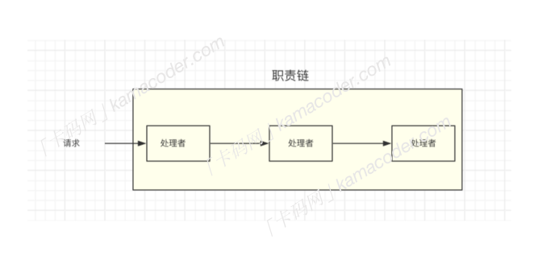
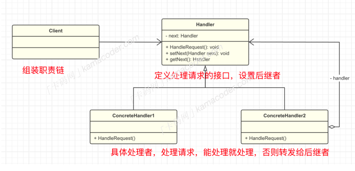

## 责任链模式  

#### 基本概念

责任链模式是⼀种⾏为型设计模式，它允许你构建⼀个对象链，让请求从链的⼀端进⼊，然后沿着链上的对象依次处理，直到链上的某个对象能够处理该请求为⽌。

职责链上的处理者就是⼀个对象，可以对请求进⾏处理或者将请求转发给下⼀个节点，这个场景在⽣活中很常⻅，就是⼀个逐层向上递交的过程，最终的请求要么被处理者所处理，要么处理不了，这也因此可能导致请求⽆法被处理。  

#### 组成结构

责任链模式包括以下⼏个基本结构：

1. 处理者 Handler ：定义⼀个处理请求的接⼝，包含⼀个处理请求的抽象⽅法和⼀个指向下⼀个处理者的链接。
2.  具体处理者 ConcreteHandler : 实现处理请求的⽅法，并判断能否处理请求，如果能够处理请求则进⾏处理，否则将请求传递给下⼀个处理者。
3. 客户端：创建并组装处理者对象链，并将请求发送到链上的第⼀个处理者。

#### 使⽤场景

责任链模式具有下⾯⼏个优点：

- 降低耦合度：将请求的发送者和接收者解耦，每个具体处理者都只负责处理与⾃⼰相关的请求，客户端不需要知道具体是哪个处理者处理请求。
- 增强灵活性：可以动态地添加或删除处理者，改变处理者之间的顺序以满⾜不同需求。

但是由于⼀个请求可能会经过多个处理者，这可能会导致⼀些性能问题，并且如果整个链上也没有合适的处理者来处理请求，就会导致请求⽆法被处理。责任链模式是设计模式中简单且常⻅的设计模式，在⽇常中也会经常使⽤到，⽐如Java开发中过滤器的链式处理，以及Spring框架中的拦截器，都组装成⼀个处理链对请求、响应进⾏处理。