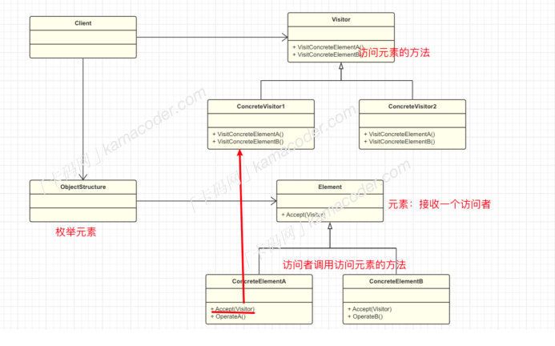

## 访问者模式

#### 基本概念 

访问者模式（Visitor Pattern）是⼀种⾏为型设计模式，可以在不改变对象结构的前提下，对对象中的元素进⾏新的操作。

举个例⼦，假设有⼀个动物园，⾥⾯有不同种类的动物，⽐如狮⼦、⼤象、猴⼦等。每个动物都会被医⽣检查身体，被管理员投喂，被游客观看，医⽣，游客，管理员都属于访问者。

如果你想对动物园中的每个动物执⾏⼀些操作，⽐如医⽣健康检查、管理员喂⻝、游客观赏等。就可以使⽤访问者模式来实现这些操作。  

#### 基本结构

访问者模式包括以下⼏个基本⻆⾊：

- 抽象访问者（Visitor）： 声明了访问者可以访问哪些元素，以及如何访问它们的⽅法 visit 。
- 具体访问者（ConcreteVisitor）： 实现了抽象访问者定义的⽅法，不同的元素类型可能有不同的访问⾏为。医⽣、管理员、游客都属于具体的访问者，它们的访问⾏为不同。
- 抽象元素（Element）： 定义了⼀个accept⽅法，⽤于接受访问者的访问。
- 具体元素（ConcreteElement）： 实现了accept⽅法，是访问者访问的⽬标。
- 对象结构（Object Structure）： 包含元素的集合，可以是⼀个列表、⼀个集合或者其他数据结构。负责遍历元素，并调⽤元素的接受⽅法。

### 使⽤场景

访问者模式结构较为复杂，但是访问者模式将同⼀类操作封装在⼀个访问者中，使得相关的操作彼此集中，提⾼了代码的可读性和维护性。它常⽤于对象结构⽐较稳定，但经常需要在此对象结构上定义新的操作，这样就⽆需修改现有的元素类，只需要定义新的访问者来添加新的操作。