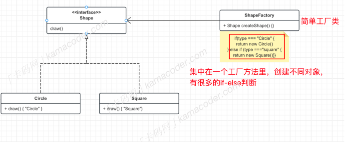
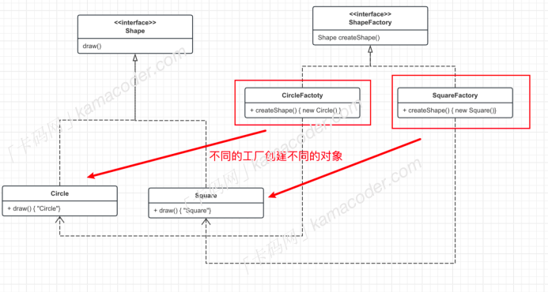

## 工厂模式

### 简单工厂模式

​		简单⼯⼚模式包括三个主要⻆⾊，⼯⼚类、抽象产品、具体产品，下⾯的图示则展示了⼯⼚类的基本结构 。



​		简单⼯⼚类简化了客户端操作，客户端可以调⽤⼯⼚⽅法来获取具体产品，⽽⽆需直接与具体产品类交互，降低了耦合，但是有⼀个很⼤的问题就是不够灵活，如果需要添加新的产品，就需要修改⼯⼚类的代码  

### 什么是⼯⼚⽅法模式

​		⼯⼚⽅法模式也是⼀种创建型设计模式，简单⼯⼚模式只有⼀个⼯⼚类，负责创建所有产品，如果要添加新的产品，通常需要修改⼯⼚类的代码。⽽⼯⼚⽅法模式引⼊了抽象⼯⼚和具体⼯⼚的概念，每个具体⼯⼚只负责创建⼀个具体产品，添加新的产品只需要添加新的⼯⼚类⽽⽆需修改原来的代码，这样就使得产品的⽣产更加灵活，⽀持扩展，符合开闭原则。

⼯⼚⽅法模式分为以下⼏个⻆⾊：

1. 抽象⼯⼚：⼀个接⼝，包含⼀个抽象的⼯⼚⽅法（⽤于创建产品对象）。
2. 具体⼯⼚：实现抽象⼯⼚接⼝，创建具体的产品。
3. 抽象产品：定义产品的接⼝。
4. 具体产品：实现抽象产品接⼝，是⼯⼚创建的对象。



```java
package Design_Pattern;

/*
 *Author：Victor_htq
 *Package：Design_Pattern
 *Project：DSnAL
 *name：factory
 *Date：2024/2/27  9:23
 *Filename：factory
 */
interface Shape {
    void draw();
}

class Circle implements Shape {
    @Override
    public void draw() {
        System.out.println("Circle");
    }
}

class Square implements Shape {
    @Override
    public void draw() {
        System.out.println("Square");
    }
}

interface ShapeFactory {
    Shape createShape();
}

class CircleFactory implements ShapeFactory {
    @Override
    public Shape createShape() {
        return new Circle();
    }
}

class  SquareFactory implements ShapeFactory {
    @Override
    public Shape createShape() {
        return new Square();
    }
}
public class factory {
    public static void main(String[] args) {
        ShapeFactory circleFactory = new CircleFactory();
        circleFactory.createShape().draw();
        ShapeFactory squareFactory = new SquareFactory();
        squareFactory.createShape().draw();
    }
}

```

### 应⽤场景⼯⼚

​		⽅法模式使得每个⼯⼚类的职责单⼀，每个⼯⼚只负责创建⼀种产品，当创建对象涉及⼀系列复杂的初始化逻辑，⽽这些逻辑在不同的⼦类中可能有所不同时，可以使⽤⼯⼚⽅法模式将这些初始化逻辑封装在⼦类的⼯⼚中。在现有的⼯具、库中，⼯⼚⽅法模式也有⼴泛的应⽤，⽐如：

1. Spring 框架中的 Bean ⼯⼚：通过配置⽂件或注解， Spring 可以根据配置信息动态地创建和管理对象。
2. JDBC 中的 Connection ⼯⼚：在 Java 数据库连接中， DriverManager 使⽤⼯⼚⽅法模式来创建数据库连接。不同的数据库驱动（如 MySQL、 PostgreSQL 等）都有对应的⼯⼚来创建连接。


## 抽象⼯⼚模式  