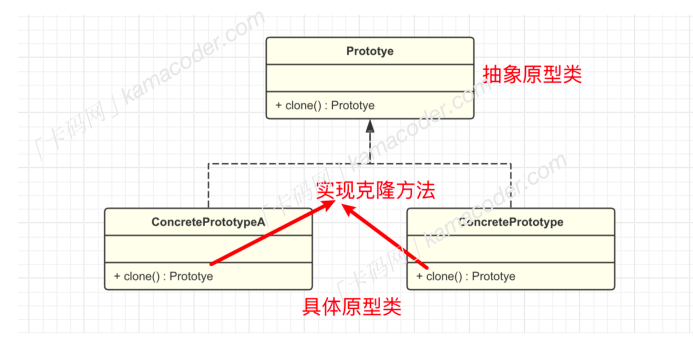

## 原型模式  

#### 什么是原型模式：

​		原型模式⼀种创建型设计模式，该模式的核⼼思想是基于现有的对象创建新的对象，⽽不是从头开始创建。在原型模式中，通常有⼀个原型对象，它被⽤作创建新对象的模板。新对象通过复制原型对象的属性和状态来创建，⽽⽆需知道具体的创建细节。

#### 为什么要使⽤原型模式：

如果⼀个对象的创建过程⽐较复杂时（⽐如需要经过⼀系列的计算和资源消耗），那每次创建该对象都需要消耗资源，⽽通过原型模式就可以复制现有的⼀个对象来迅速创建/克隆⼀个新对象，不必关⼼具体的创建细节，可以降低对象创建的成本。

```python
import copy

class ComplexObject:
	def __init__(self, data):
	# 耗时的资源型操作
		self.data = data
	def clone(self):
	# 复制
		return copy.deepcopy(self)
# 创建原型对象
original_object = ComplexObject(data="large date")
# 创建新对象，直接拷⻉原对象
new_object = original_object.clone()
```

#### 原型模式的基本结构

​		实现原型模式需要给【原型对象】声明⼀个克隆⽅法，执⾏该⽅法会创建⼀个当前类的新对象，并将原始对象中的成员变量复制到新⽣成的对象中，⽽不必实例化。并且在这个过程中只需要调⽤原型对象的克隆⽅法，⽽⽆需知道原型对象的具体类型。		原型模式包含两个重点模块：

1. 抽象原型接⼝ prototype : 声明⼀个克隆⾃身的⽅法 clone
2. 具体原型类 ConcretePrototype : 实现 clone ⽅法，复制当前对象并返回⼀个新对象。

在客户端代码中，可以声明⼀个具体原型类的对象，然后调⽤ clone() ⽅法复制原对象⽣成⼀个新的对象。  



#### 原型模式的基本实现

原型模式的实现过程即上⾯描述模块的实现过程：

1. 创建⼀个抽象类或接⼝，声明⼀个克隆⽅法 clone
2. 实现具体原型类，重写克隆⽅法
3. 客户端中实例化具体原型类的对象，并调⽤其克隆⽅法来创建新的对象。

##### 什么时候实现原型模式

​		相⽐于直接实例化对象，通过原型模式复制对象可以减少资源消耗，提⾼性能，尤其在对象的创建过程复杂或对象的创建代价较⼤的情况下。当需要频繁创建相似对象、并且可以通过克隆避免重复初始化⼯作的场景时可以考虑使⽤原型模式，在克隆对象的时候还可以动态地添加或删除原型对象的属性，创造出相似但不完全相同的对象，提⾼了灵活性。

​		但是使⽤原型模式也需要考虑到如果对象的内部状态包含了引⽤类型的成员变量，那么实现深拷⻉就会变得较为复杂，需要考虑引⽤类型对象的克隆问题。

​		原型模式在现有的很多语⾔中都有应⽤，⽐如以下⼏个经典例⼦。

1. Java 提供了 Object 类的 clone() ⽅法，可以实现对象的浅拷⻉。类需要实现 Cloneable 接⼝并重写clone() ⽅法。
2. 在 .NET 中， ICloneable 接⼝提供了 Clone ⽅法，可以⽤于实现对象的克隆。
3. Spring 框架中的 Bean 的作⽤域之⼀是原型作⽤域（Prototype Scope），在这个作⽤域下， Spring 框架会为每次请求创建⼀个新的 Bean 实例，类似于原型模式。