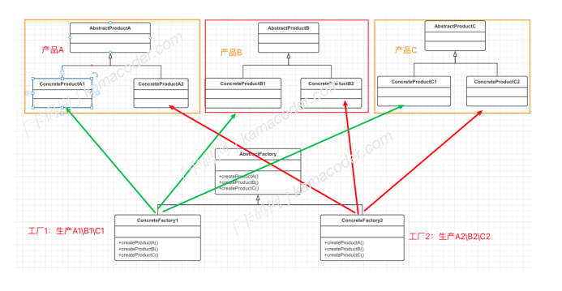

## 工厂模式

### 抽象工厂模式：

抽象⼯⼚模式也是⼀种创建型设计模式，提供了⼀个创建⼀系列相关或相互依赖对象的接⼝，⽽⽆需指定它们具体的类 。

在⼯⼚⽅法模式中，每个具体⼯⼚只负责创建单⼀的产品。但是如果有多类产品呢，⽐如说“⼿机”，⼀个品牌的⼿机有⾼端机、中低端机之分，这些具体的产品都需要建⽴⼀个单独的⼯⼚类，但是它们都是相互关联的，都共同属于同⼀个品牌，这就可以使⽤到【抽象⼯⼚模式】。  

抽象⼯⼚模式可以确保⼀系列相关的产品被⼀起创建，这些产品能够相互配合使⽤，再举个例⼦，有⼀些家具，⽐如沙发、茶⼏、椅⼦，都具有古典⻛格的和现代⻛格的，抽象⼯⼚模式可以将⽣产现代⻛格的家具放在⼀个⼯⼚类中，将⽣产古典⻛格的家具放在另⼀个⼯⼚类中，这样每个⼯⼚类就可以⽣产⼀系列的家具。  

### 基本结构

抽象⼯⼚模式包含多个抽象产品接⼝，多个具体产品类，⼀个抽象⼯⼚接⼝和多个具体⼯⼚，每个具体⼯⼚负责创建⼀组相关的产品。

1. 抽象产品接⼝ AbstractProduct : 定义产品的接⼝，可以定义多个抽象产品接⼝，⽐如说沙发、椅⼦、茶⼏都是抽象产品。
2. 具体产品类 ConcreteProduct : 实现抽象产品接⼝，产品的具体实现，古典⻛格和沙发和现代⻛格的沙发都是具体产品。
3. 抽象⼯⼚接⼝ AbstractFactory : 声明⼀组⽤于创建产品的⽅法，每个⽅法对应⼀个产品。
4. 具体⼯⼚类 ConcreteFactory ： 实现抽象⼯⼚接⼝，负责创建⼀组具体产品的对象，在本例中，⽣产古典⻛格的⼯⼚和⽣产现代⻛格的⼯⼚都是具体实例。

