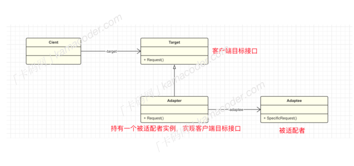
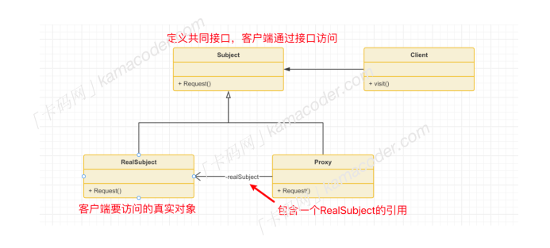

## 适配器模式

#### 什么是适配器适配器模式 

Adapter 是⼀种结构型设计模式，它可以将⼀个类的接⼝转换成客户希望的另⼀个接⼝，主要⽬的是充当两个不同接⼝之间的桥梁，使得原本接⼝不兼容的类能够⼀起⼯作。

#### 基本结构

适配器模式分为以下⼏个基本⻆⾊：

​		可以把适配器模式理解成拓展坞，起到转接的作⽤，原有的接⼝是USB，但是客户端需要使⽤ type-c ， 便使⽤拓展坞提供⼀个 type-c 接⼝给客户端使⽤  

1. ⽬标接⼝ Target : 客户端希望使⽤的接⼝
2. 适配器类 Adapter : 实现客户端使⽤的⽬标接⼝，持有⼀个需要适配的类实例。
3. 被适配者 Adaptee : 需要被适配的类

#### 应⽤场景

在开发过程中，适配器模式往往扮演者“补救”和“扩展”的⻆⾊：

1. 当使⽤⼀个已经存在的类，但是它的接⼝与你的代码不兼容时，可以使⽤适配器模式。
2. 在系统扩展阶段需要增加新的类时，并且类的接⼝和系统现有的类不⼀致时，可以使⽤适配器模式。

​		使⽤适配器模式可以将客户端代码与具体的类解耦，客户端不需要知道被适配者的细节，客户端代码也不需要修改，这使得它具有良好的扩展性，但是这也势必导致系统变得更加复杂。具体来说，适配器模式有着以下应⽤：

1. 不同的项⽬和库可能使⽤不同的⽇志框架，不同的⽇志框架提供的API也不同，因此引⼊了适配器模式使得不同的API适配为统⼀接⼝。
2. Spring MVC中， HandlerAdapter 接⼝是适配器模式的⼀种应⽤。它负责将处理器（Handler）适配到框架中，使得不同类型的处理器能够统⼀处理请求。
3. 在 .NET 中， DataAdapter ⽤于在数据源（如数据库）和 DataSet 之间建⽴适配器，将数据从数据源适配到 DataSet 中，以便在.NET应⽤程序中使⽤。

## 代理模式  

#### 基本概念

​		代理模式 Proxy Pattern 是⼀种结构型设计模式，⽤于控制对其他对象的访问。

​		在代理模式中，允许⼀个对象（代理）充当另⼀个对象（真实对象）的接⼝，以控制对这个对象的访问。通常⽤于在访问某个对象时引⼊⼀些间接层(中介的作⽤)，这样可以在访问对象时添加额外的控制逻辑，⽐如限制访问权限，延迟加载。

​		⽐如说有⼀个⽂件加载的场景，为了避免直接访问“⽂件”对象，我们可以新增⼀个代理对象，代理对象中有⼀个对“⽂件对象”的引⽤，在代理对象的 load ⽅法中，可以在访问真实的⽂件对象之前进⾏⼀些操作，⽐如权限检查，然后调⽤真实⽂件对象的 load ⽅法，最后在访问真实对象后进⾏其他操作，⽐如记录访问⽇志。

#### 基本结构  

#### 使⽤场景

​		代理模式可以控制客户端对真实对象的访问，从⽽限制某些客户端的访问权限，此外代理模式还常⽤在访问真实对象之前或之后执⾏⼀些额外的操作（⽐如记录⽇志），对功能进⾏扩展。

以上特性决定了代理模式在以下⼏个场景中有着⼴泛的应⽤：

1. 虚拟代理：当⼀个对象的创建和初始化⽐较昂贵时，可以使⽤虚拟代理，虚拟代理可以延迟对象的实际创建和初始化，只有在需要时才真正创建并初始化对象。
2. 安全代理：安全代理可以根据访问者的权限决定是否允许访问真实对象的⽅法。

但是代理模式涉及到多个对象之间的交互，引⼊代理模式会增加系统的复杂性，在需要频繁访问真实对象时，还可能会有⼀些性能问题。

代理模式在许多⼯具和库中也有应⽤：

1. Spring 框架的 AOP 模块使⽤了代理模式来实现切⾯编程。通过代理， Spring 能够在⽬标对象的⽅法执⾏前、执⾏后或抛出异常时插⼊切⾯逻辑，⽽不需要修改原始代码。
2. Java 提供了动态代理机制，允许在运⾏时⽣成代理类。
3. Android中的Glide框架使⽤了代理模式来实现图⽚的延迟加载。

#### 扩展：代理模式和适配器模式有什么区别

代理模式的主要⽬的是控制对对象的访问。通常⽤于在访问真实对象时引⼊⼀些额外的控制逻辑，如权限控制、延迟加载等。

适配器模式的主要⽬的是使接⼝不兼容的对象能够协同⼯作。适配器模式允许将⼀个类的接⼝转换成另⼀个类的接⼝，使得不同接⼝的类可以协同⼯作。