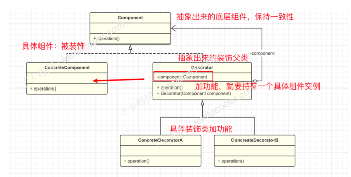

### 装饰器模式

#### 基本概念

​		通常情况下，扩展类的功能可以通过继承实现，但是扩展越多，⼦类越多，装饰模式（ Decorator Pattern , 结构型设计模式）可以在不定义⼦类的情况下动态的给对象添加⼀些额外的功能。 具体的做法是将原始对象放⼊包含⾏为的特殊封装类(装饰类)，从⽽为原始对象动态添加新的⾏为，⽽⽆需修改其代码。

​		举个简单的例⼦，假设你有⼀个基础的图形类，你想要为图形类添加颜⾊、边框、阴影等功能，如果每个功能都实现⼀个⼦类，就会导致产⽣⼤量的类，这时就可以考虑使⽤装饰模式来动态地添加，⽽不需要修改图形类本身的代码，这样可以使得代码更加灵活、更容易维护和扩展。  

#### 应⽤场景

装饰模式通常在以下⼏种情况使⽤：

1. 当需要给⼀个现有类添加附加功能，但由于某些原因不能使⽤继承来⽣成⼦类进⾏扩充时，可以使⽤装饰模式。
2. 动态的添加和覆盖功能：当对象的功能要求可以动态地添加，也可以再动态地撤销时可以使⽤装饰模式。

在Java的I/O库中，装饰者模式被⼴泛⽤于增强I/O流的功能。例如， BufferedInputStream 和BufferedOutputStream 这两个类提供了缓冲区的⽀持，通过在底层的输⼊流和输出流上添加缓冲区，提⾼了读写的效率，它们都是 InputStream 和 OutputStream 的装饰器。 BufferedReader 和 BufferedWriter 这两个类与 BufferedInputStream 和 BufferedOutputStream 类似，提供了字符流的缓冲功能，是Reader和Writer的装饰者。