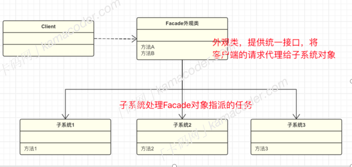

## 外观模式

​		外观模式 Facade Pattern , 也被称为“⻔⾯模式”，是⼀种结构型设计模式，外观模式定义了⼀个⾼层接⼝，这个接⼝使得⼦系统更容易使⽤，同时也隐藏了⼦系统的复杂性。

​		⻔⾯模式可以将⼦系统关在“⻔⾥”隐藏起来，客户端只需要通过外观接⼝与外观对象进⾏交互，⽽不需要直接和多个⼦系统交互，⽆论⼦系统多么复杂，对于外部来说是隐藏的，这样可以降低系统的耦合度。

​		举个例⼦，假设你正在编写的⼀个模块⽤来处理⽂件读取、解析、存储，我们可以将这个过程拆成三部分，然后创建⼀个外观类，将⽂件系统操作、数据解析和存储操作封装在外观类中，为客户端提供⼀个简化的接⼝，如果后续需要修改⽂件处理的流程或替换底层⼦系统，也只需在外观类中进⾏调整，不会影响客户端代码。

- 外观类：对外提供⼀个统⼀的⾼层次接⼝，使复杂的⼦系统变得更易使⽤。
- ⼦系统类：实现⼦系统的功能，处理外观类指派的任务。

#### 优缺点和使⽤场景

​		外观模式通过提供⼀个简化的接⼝，隐藏了系统的复杂性，降低了客户端和⼦系统之间的耦合度，客户端不需要了解系统的内部实现细节，也不需要直接和多个⼦系统交互，只需要通过外观接⼝与外观对象进⾏交互。

​		但是如果需要添加新的⼦系统或修改⼦系统的⾏为，就可能需要修改外观类，这违背了“开闭原则”。

​		外观模式的应⽤也⼗分普遍，下⾯⼏种情况都使⽤了外观模式来进⾏简化。

- Spring框架是⼀个⼴泛使⽤外观模式的例⼦。 Spring框架提供了⼀个⼤量的功能，包括依赖注⼊、⾯向切⾯编程（AOP）、事务管理等。 Spring的 ApplicationContext 可以看作是外观，隐藏了底层组件的复杂性，使得开发者可以更轻松地使⽤Spring的功能。
- JDBC提供了⼀个⽤于与数据库交互的接⼝。 DriverManager 类可以看作是外观，它简化了数据库驱动的加载和连接的过程，隐藏了底层数据库连接的复杂性。
- Android系统的API中也使⽤了外观模式。例如， Activity 类提供了⼀个外观，使得开发者可以更容易地管理应⽤的⽣命周期，⽽⽆需关⼼底层的事件和状态管理。