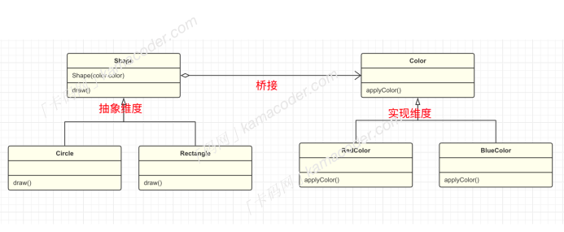
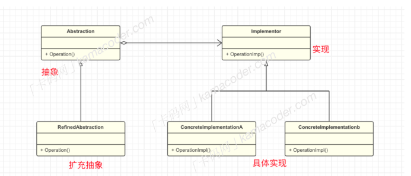

## 桥接模式  

​		桥接模式（Bridge Pattern）是⼀种结构型设计模式，它的UML图很像⼀座桥，它通过将【抽象部分】与【实现部分】分离，使它们可以独⽴变化，从⽽达到降低系统耦合度的⽬的。桥接模式的主要⽬的是通过组合建⽴两个类之间的联系，⽽不是继承的⽅式。  

​		举个简单的例⼦，图形编辑器中，每⼀种图形都需要蓝⾊、红⾊、⻩⾊不同的颜⾊，如果不使⽤桥接模式，可能需要为每⼀种图形类型和每⼀种颜⾊都创建⼀个具体的⼦类，⽽使⽤桥接模式可以将图形和颜⾊两个维度分离，两个维度都可以独⽴进⾏变化和扩展，如果要新增其他颜⾊，只需添加新的 Color ⼦类，不影响图形类；反之亦然。  

基本结构桥接模式的基本结构分为以下⼏个⻆⾊：

- 抽象 Abstraction ：⼀般是抽象类，定义抽象部分的接⼝，维护⼀个对【实现】的引⽤。
- 修正抽象 RefinedAbstaction ：对抽象接⼝进⾏扩展，通常对抽象化的不同维度进⾏变化或定制。
- 实现 Implementor ： 定义实现部分的接⼝，提供具体的实现。这个接⼝通常是抽象化接⼝的实现。
- 具体实现 ConcreteImplementor ：实现实现化接⼝的具体类。这些类负责实现实现化接⼝定义的具体操作。

​		再举个例⼦，遥控器就是抽象接⼝，它具有开关电视的功能，修正抽象就是遥控器的实例，对遥控器的功能进⾏实现和扩展，⽽电视就是实现接⼝，具体品牌的电视机是具体实现，遥控器中包含⼀个对电视接⼝的引⽤，通过这种⽅式，遥控器和电视的实现被分离，我们可以创建多个遥控器，每个遥控器控制⼀个品牌的电视机，它们之间独⽴操作，不受电视品牌的影响，可以独⽴变化。  

​		桥接模式在⽇常开发中使⽤的并不是特别多，通常在以下情况下使⽤：当⼀个类存在两个独⽴变化的维度，⽽且这两个维度都需要进⾏扩展时，使⽤桥接模式可以使它们独⽴变化，减少耦合。不希望使⽤继承，或继承导致类爆炸性增⻓总体⽽⾔，桥接模式适⽤于那些有多个独⽴变化维度、需要灵活扩展的系统。