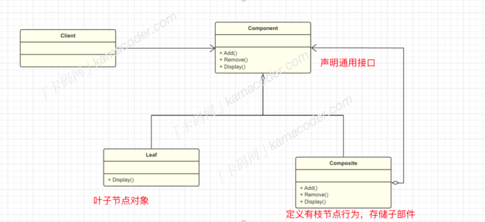

## 组合模式  

#### 基本概念

​		组合模式是⼀种结构型设计模式，它将对象组合成树状结构来表示“部分-整体”的层次关系。组合模式使得客户端可以统⼀处理单个对象和对象的组合，⽽⽆需区分它们的具体类型。

理解起来⽐较抽象，我们⽤“省份-城市”举个例⼦，省份中包含了多个城市，如果将之⽐喻成⼀个树形结构，城市就是叶⼦节点，它是省份的组成部分，⽽“省份”就是合成节点，可以包含其他城市，形成⼀个整体，省份和城市都是组件，它们都有⼀个共同的操作，⽐如获取信息。

1. Component 组件： 组合模式的“根节点”，定义组合中所有对象的通⽤接⼝，可以是抽象类或接⼝。该类中定义了⼦类的共性内容。
2. Leaf 叶⼦：实现了Component接⼝的叶⼦节点，表示组合中的叶⼦对象，叶⼦节点没有⼦节点。
3. Composite 合成： 作⽤是存储⼦部件，并且在Composite中实现了对⼦部件的相关操作，⽐如添加、删除、获取⼦组件等。通过组合模式，整个省份的获取信息操作可以⼀次性地执⾏，⽽⽆需关⼼省份中的具体城市。这样就实现了对国家省份和城市的管理和操作。

#### 使⽤场景

​		组合模式可以使得客户端可以统⼀处理单个对象和组合对象，⽆需区分它们之间的差异，⽐如在图形编辑器中，图形对象可以是简单的线、圆形，也可以是复杂的组合图形，这个时候可以对组合节点添加统⼀的操作。总的来说，组合模式适⽤于任何需要构建具有部分-整体层次结构的场景，⽐如组织架构管理、⽂件系统的⽂件和⽂件夹组织等。