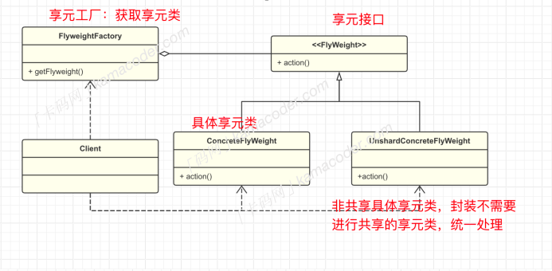
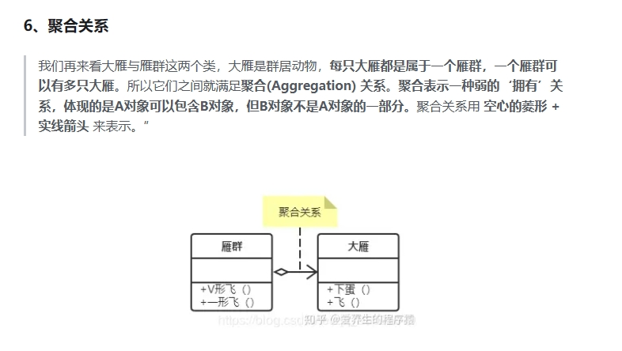
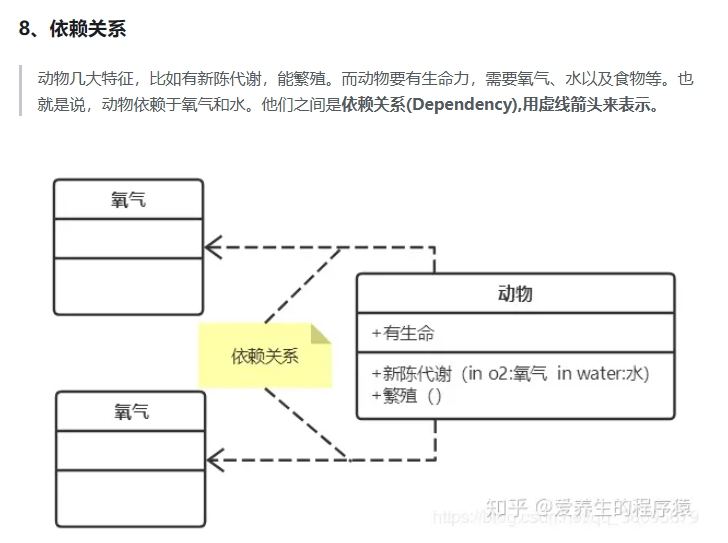
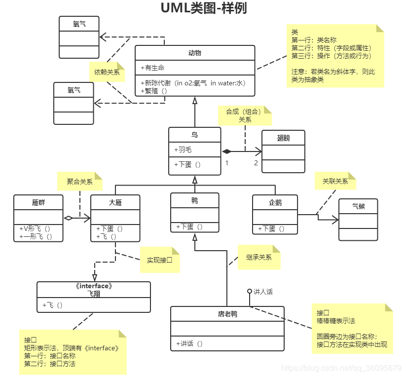

## 享元模式

#### 基础概念  

​		享元模式是⼀种结构型设计模式，在享元模式中，对象被设计为可共享的，可以被多个上下⽂使⽤，⽽不必在每个上下⽂中都创建新的对象。  

要了解享元模式，就必须要区分什么是内部状态，什么是外部状态。

- 内部状态是指那些可以被多个对象共享的状态，它存储在享元对象内部，并且对于所有享元对象都是相同的，这部分状态通常是不变的。
- ⽽外部状态是享元对象依赖的、可能变化的部分。这部分状态不存储在享元对象内部，⽽是在使⽤享元对象时通过参数传递给对象。

举个例⼦，图书馆中有很多相同的书籍，但每本书都可以被多个⼈借阅，图书馆⾥的书就是内部状态，⼈就是外部状态。  

再举个开发中的例⼦，假设我们在构建⼀个简单的图形编辑器，⽤户可以在画布上绘制不同类型的图形，⽽图形就是所有图形对象的内部状态（不变的），⽽图形的坐标位置就是图形对象的外部状态（变化的）。

如果图形编辑器中有成千上万的图形对象，每个图形对象都独⽴创建并存储其内部状态，那么系统的内存占⽤可能会很⼤，在这种情况下，享元模式共享相同类型的图形对象，每种类型的图形对象只需创建⼀个共享实例，然后通过设置不同的坐标位置个性化每个对象，通过共享相同的内部状态，降低了对象的创建和内存占⽤成本。

#### 基本结构  

- 享元接⼝ Flyweight : 所有具体享元类的共享接⼝，通常包含对外部状态的操作。
- 具体享元类 ConcreteFlyweight : 继承 Flyweight 类或实现享元接⼝，包含内部状态。
- 享元⼯⼚类 FlyweightFactory : 创建并管理享元对象，当⽤户请求时，提供已创建的实例或者创建⼀个。客户端 Client : 维护外部状态，在使⽤享元对象时，将外部状态传递给享元对象。

#### 使⽤场景

​		使⽤享元模式的关键在于包含⼤量相似对象，并且这些对象的内部状态可以共享。具体的应⽤场景包括⽂本编辑器，图形编辑器，游戏中的⻆⾊创建，这些对象的内部状态⽐较固定(外观，技能，形状)，但是外部状态变化⽐较⼤时，可以使⽤。