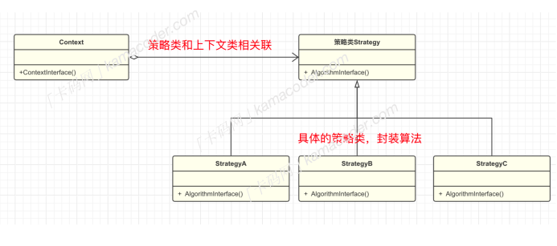

## 策略模式

#### 基本概念

策略模式是⼀种⾏为型设计模式，它定义了⼀系列算法（这些算法完成的是相同的⼯作，只是实现不同），并将每个算法封装起来，使它们可以相互替换，⽽且算法的变化不会影响使⽤算法的客户。

举个例⼦，电商⽹站对于商品的折扣策略有不同的算法，⽐如新⽤户满减优惠，不同等级会员的打折情况不同，这种情况下会产⽣⼤量的 if-else语句 , 并且如果优惠政策修改时，还需要修改原来的代码，不符合开闭原则。这就可以将不同的优惠算法封装成独⽴的类来避免⼤量的条件语句，如果新增优惠算法，可以添加新的策略类来实现，客户端在运⾏时选择不同的具体策略，⽽不必修改客户端代码改变优惠策略。

#### 基本结构

策略模式包含下⾯⼏个结构：

- 策略类 Strategy : 定义所有⽀持的算法的公共接⼝。
- 具体策略类 ConcreteStrategy : 实现了策略接⼝，提供具体的算法实现。
- 上下⽂类 Context : 包含⼀个策略实例，并在需要时调⽤策略对象的⽅法。

#### 使⽤场景

- 当⼀个系统根据业务场景需要动态地在⼏种算法中选择⼀种时，可以使⽤策略模式。例如，根据⽤户的⾏为选择不同的计费策略。
- 当代码中存在⼤量条件判断，条件判断的区别仅仅在于⾏为，也可以通过策略模式来消除这些条件语句。

在已有的⼯具库中， Java 标准库中的 Comparator 接⼝就使⽤了策略模式，通过实现这个接⼝，可以创建不同的⽐较器（指定不同的排序策略）来满⾜不同的排序需求。