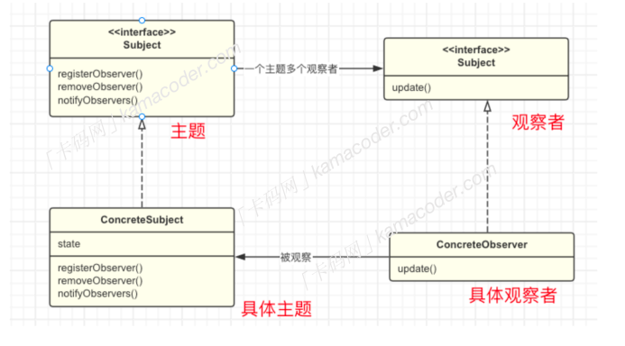

## 观察者模式

​		观察者模式（发布-订阅模式）属于⾏为型模式，定义了⼀种⼀对多的依赖关系，让多个观察者对象同时监听⼀个主题对象，当主题对象的状态发⽣变化时，所有依赖于它的观察者都得到通知并被⾃动更新。  

观察者模式依赖两个模块：

- Subject (主题)：也就是被观察的对象，它可以维护⼀组观察者，当主题本身发⽣改变时就会通知观察者。
- Observer (观察者)：观察主题的对象，当“被观察”的主题发⽣变化时，观察者就会得到通知并执⾏相应的处理。

​		使⽤观察者模式有很多好处，⽐如说观察者模式将主题和观察者之间的关系解耦，主题只需要关注⾃⼰的状态变化，⽽观察者只需要关注在主题状态变化时需要执⾏的操作，两者互不⼲扰，并且由于观察者和主题是相互独⽴的，可以轻松的增加和删除观察者，这样实现的系统更容易扩展和维护。  

#### 观察者模式的结构

观察者模式依赖主题和观察者，但是⼀般有4个组成部分：

- 主题Subject ：⼀般会定义成⼀个接⼝，提供⽅法⽤于注册、删除和通知观察者，通常也包含⼀个状态，当状态发⽣改变时，通知所有的观察者。
- 观察者Observer : 观察者也需要实现⼀个接⼝，包含⼀个更新⽅法，在接收主题通知时执⾏对应的操作。
- 具体主题ConcreteSubject : 主题的具体实现，维护⼀个观察者列表，包含了观察者的注册、删除和通知⽅法。
- 具体观察者ConcreteObserver : 观察者接⼝的具体实现，每个具体观察者都注册到具体主题中，当主题状态变化并通知到具体观察者，具体观察者进⾏处理。