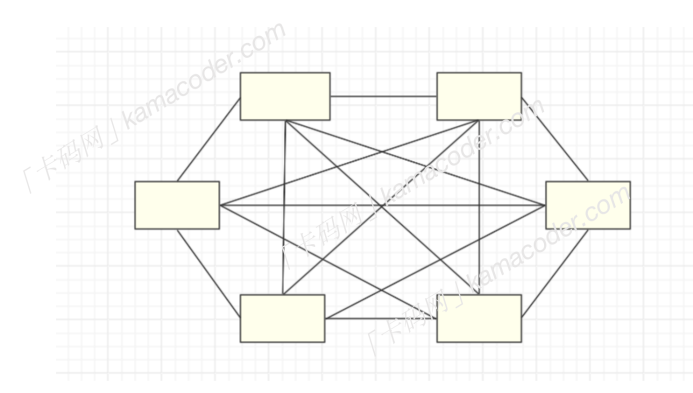
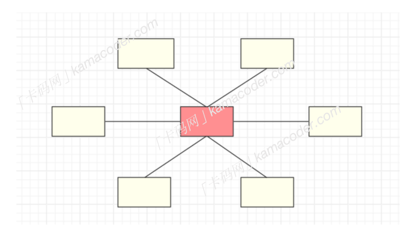
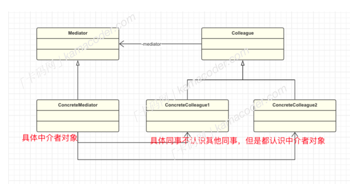

## 中介者模式

#### 基本概念

中介者模式（Mediator Pattern）也被称为调停者模式，是⼀种⾏为型设计模式，它通过⼀个中介对象来封装⼀组对象之间的交互，从⽽使这些对象不需要直接相互引⽤。这样可以降低对象之间的耦合度，使系统更容易维护和扩展。

当⼀个系统中的对象有很多且多个对象之间有复杂的相互依赖关系时，其结构图可能是下⾯这样的。  

这种依赖关系很难理清，这时我们可以引⼊⼀个中介者对象来进⾏协调和交互。中介者模式可以使得系统的⽹状结构变成以中介者为中⼼的星形结构，每个具体对象不再通过直接的联系与另⼀个对象发⽣相互作⽤，⽽是通过“中介者”对象与另⼀个对象发⽣相互作⽤。  

#### 基本结构

中介者模式包括以下⼏个重要⻆⾊：

- 抽象中介者（Mediator）： 定义中介者的接⼝，⽤于各个具体同事对象之间的通信。
- 具体中介者（Concrete Mediator）： 实现抽象中介者接⼝，负责协调各个具体同事对象的交互关系，它需要知道所有具体同事类，并从具体同事接收消息，向具体同事对象发出命令。
- 抽象同事类（Colleague）： 定义同事类的接⼝，维护⼀个对中介者对象的引⽤，⽤于通信。
- 具体同事类（Concrete Colleague）： 实现抽象同事类接⼝，每个具体同事类只知道⾃⼰的⾏为，⽽不了解其他同事类的情况，因为它们都需要与中介者通信，通过中介者协调与其他同事对象的交互。

#### 使⽤场景

中介者模式使得同事对象不需要知道彼此的细节，只需要与中介者进⾏通信，简化了系统的复杂度，也降低了各对象之间的耦合度，但是这也会使得中介者对象变得过于庞⼤和复杂，如果中介者对象出现问题，整个系统可能会受到影响。

中介者模式适⽤于当系统对象之间存在复杂的交互关系或者系统需要在不同对象之间进⾏灵活的通信时使⽤，可以使得问题简化，。