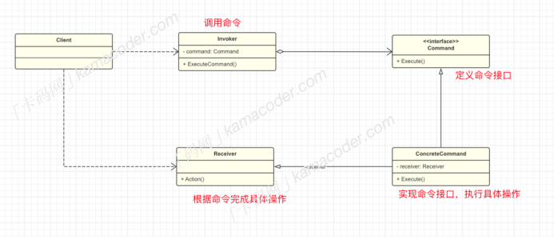

## 命令模式

#### 基本概念

​		命令模式是⼀种⾏为型设计模式，其允许将请求封装成⼀个对象(命令对象，包含执⾏操作所需的所有信息)， 并将命令对象按照⼀定的顺序存储在队列中，然后再逐⼀调⽤执⾏，这些命令也可以⽀持反向操作，进⾏撤销和重做。

​		这样⼀来，发送者只需要触发命令就可以完成操作，不需要知道接受者的具体操作，从⽽实现两者间的解耦。

​		举个现实中的应⽤场景，遥控器可以控制不同的设备，在命令模式中，可以假定每个按钮都是⼀个命令对象，包含执⾏特定操作的命令，不同设备对同⼀命令的具体操作也不同，这样就可以⽅便的添加设备和命令对象。

- 命令接⼝ Command ：接⼝或者抽象类，定义执⾏操作的接⼝。具体命令类 ConcreteCommand : 
- 实现命令接⼝，执⾏具体操作，在调⽤ execute ⽅法时使“接收者对象”根据命令完成具体的任务，⽐如遥控器中的“开机”， “关机”命令。
- 接收者类 Receiver : 接受并执⾏命令的对象，可以是任何对象，遥控器可以控制空调，也可以控制电视机，电视机和空调负责执⾏具体操作，是接收者。
- 调⽤者类 Invoker : 发起请求的对象，有⼀个将命令作为参数传递的⽅法。它不关⼼命令的具体实现，只负责调⽤命令对象的 execute() ⽅法来传递请求，在本例中，控制遥控器的“⼈”就是调⽤者。
- 客户端：创建具体的命令对象和接收者对象，然后将它们组装起来。

#### 优缺点和使⽤场景

命令模式在需要将请求封装成对象、⽀持撤销和重做、设计命令队列等情况下，都是⼀个有效的设计模式。

- 撤销操作： 需要⽀持撤销操作，命令模式可以存储历史命令，轻松实现撤销功能。
- 队列请求： 命令模式可以将请求排队，形成⼀个命令队列，依次执⾏命令。
- 可扩展性： 可以很容易地添加新的命令类和接收者类，⽽不影响现有的代码。新增命令不需要修改现有代码，符合开闭原则。

但是对于每个命令，都会有⼀个具体命令类，这可能导致类的数量急剧增加，增加了系统的复杂性。

命令模式同样有着很多现实场景的应⽤，⽐如Git中的很多操作，如提交（commit）、合并（merge）等，都可以看作是命令模式的应⽤，⽤户通过执⾏相应的命令来操作版本库。 Java的GUI编程中，很多事件处理机制也都使⽤了命令模式。例如，每个按钮都有⼀个关联的 Action ，它代表⼀个命令，按钮的点击触发 Action 的执⾏。