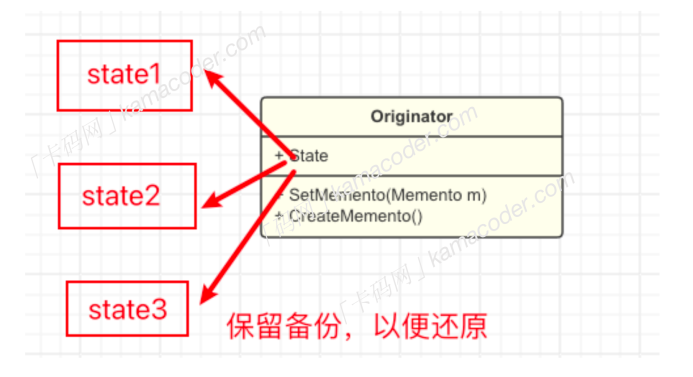

## 备忘录模式

#### 基本概念  

备忘录模式（Memento Pattern）是⼀种⾏为型设计模式，它允许在不暴露对象实现的情况下捕获对象的内部状态并在对象之外保存这个状态，以便稍后可以将其还原到先前的状态。  

#### 基本结构

备忘录模式包括以下⼏个重要⻆⾊：

- 发起⼈ Originator ： 需要还原状态的那个对象，负责创建⼀个【备忘录】，并使⽤备忘录记录当前时刻的内部状态。
- 备忘录 Memento : 存储发起⼈对象的内部状态，它可以包含发起⼈的部分或全部状态信息，但是对外部是不可⻅的，只有发起⼈能够访问备忘录对象的状态。
- 备忘录有两个接⼝，发起⼈能够通过宽接⼝访问数据，管理者只能看到窄接⼝，并将备忘录传递给其他对象。
- 管理者 Caretaker : 负责存储备忘录对象，但并不了解其内部结构，管理者可以存储多个备忘录对象。
- 客户端：在需要恢复状态时，客户端可以从管理者那⾥获取备忘录对象，并将其传递给发起⼈进⾏状态的恢复。

