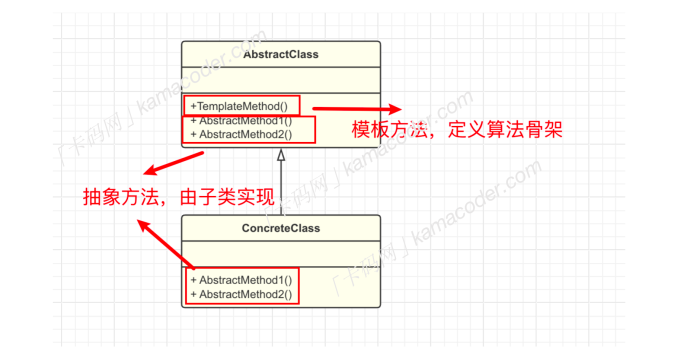

## 模板方法

#### 基本概念

模板⽅法模式（Template Method Pattern）是⼀种⾏为型设计模式, 它定义了⼀个算法的⻣架，将⼀些步骤的实现延迟到⼦类。 模板⽅法模式使得⼦类可以在不改变算法结构的情况下，重新定义算法中的某些步骤。

做⼀道菜通常都需要包含⾄少三步：

- 准备⻝材
- 亨饪过程
- 上菜

不同菜品的亨饪过程是不⼀样的，但是我们可以先定义⼀个”⻣架”，包含这三个步骤，亨饪过程的过程放到具体的炒菜类中去实现，这样，⽆论炒什么菜，都可以沿⽤相同的炒菜算法，只需在⼦类中实现具体的炒菜步骤，从⽽提⾼了代码的复⽤性。

- 模板类 AbstractClass ：由⼀个模板⽅法和若⼲个基本⽅法构成，模板⽅法定义了逻辑的⻣架，按照顺序调⽤包含的基本⽅法，基本⽅法通常是⼀些抽象⽅法，这些⽅法由⼦类去实现。基本⽅法还包含⼀些具体⽅法，它们是算法的⼀部分但已经有默认实现，在具体⼦类中可以继承或者重写。
- 具体类 ConcreteClass ：继承⾃模板类，实现了在模板类中定义的抽象⽅法，以完成算法中特定步骤的具体实现。

#### 应⽤场景

模板⽅法模式将算法的不变部分被封装在模板⽅法中，⽽可变部分算法由⼦类继承实现，这样做可以很好的提⾼代码的复⽤性，但是当算法的框架发⽣变化时，可能需要修改模板类，这也会影响到所有的⼦类。

总体来说，当算法的整体步骤很固定，但是个别步骤在更详细的层次上的实现可能不同时，通常考虑模板⽅法模式来处理。在已有的⼯具和库中， Spring框架中的 JdbcTemplate 类使⽤了模板⽅法模式，其中定义了⼀些执⾏数据库操作的模板⽅法，具体的数据库操作由回调函数提供。⽽在Java的JDK源码中， AbstractList 类也使⽤了模板⽅法模式，它提供了⼀些通⽤的⽅法，其中包括⼀些模板⽅法。具体的列表操作由⼦类实现。