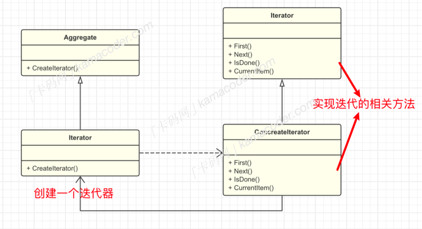

## 迭代器模式

#### 基本概念

迭代器模式是⼀种⾏为设计模式，是⼀种使⽤频率⾮常⾼的设计模式，在各个语⾔中都有应⽤，其主要⽬的是提供⼀种统⼀的⽅式来访问⼀个聚合对象中的各个元素， ⽽不需要暴露该对象的内部表示。通过迭代器，客户端可以顺序访问聚合对象的元素，⽽⽆需了解底层数据结构。

迭代器模式应⽤⼴泛，但是⼤多数语⾔都已经内置了迭代器接⼝，不需要⾃⼰实现。  

#### 基本结构

迭代器模式包括以下⼏个重要⻆⾊

- 迭代器接⼝ Iterator ：定义访问和遍历元素的接⼝, 通常会包括 hasNext() ⽅法⽤于检查是否还有下⼀个元素，以及 next() ⽅法⽤于获取下⼀个元素。有的还会实现获取第⼀个元素以及获取当前元素的⽅法。
- 具体迭代器 ConcreateIterator ：实现迭代器接⼝，实现遍历逻辑对聚合对象进⾏遍历。
- 抽象聚合类：定义了创建迭代器的接⼝，包括⼀个 createIterator ⽅法⽤于创建⼀个迭代器对象。
- 具体聚合类：实现在抽象聚合类中声明的 createIterator() ⽅法，返回⼀个与具体聚合对应的具体迭代器

#### 使⽤场景

迭代器模式是⼀种通⽤的设计模式，其封装性强，简化了客户端代码，客户端不需要知道集合的内部结构，只需要关⼼迭代器和迭代接⼝就可以完成元素的访问。但是引⼊迭代器模式会增加额外的类，每增加⼀个集合类，都需要增加该集合对应的迭代器，这也会使得代码结构变得更加复杂。

许多编程语⾔和框架都使⽤了这个模式提供⼀致的遍历和访问集合元素的机制。下⾯是⼏种常⻅语⾔迭代器模式的实现。

1. Java语⾔：集合类（如ArrayList、 LinkedList), 通过 Iterator 接⼝，可以遍历集合中的元素。
2. Python语⾔：使⽤迭代器和⽣成器来实现迭代模式， iter() 和 next() 函数可以⽤于创建和访问迭代器。  
3. C++语⾔： C++中的STL提供了迭代器的⽀持， begin() 和 end() 函数可以⽤于获取容器的起始和结束迭代器。