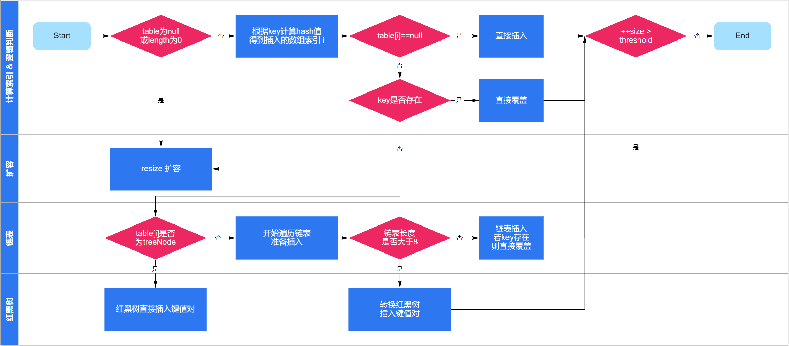

## Day2-Java基础

#### 1.28 使用字符串时，new和""推荐使用哪种方式？

**参考答案**

先看看 "hello" 和 new String("hello") 的区别：

- 当Java程序直接使用 "hello" 的字符串直接量时，JVM将会使用常量池来管理这个字符串；
- 当使用 new String("hello") 时，JVM会先使用常量池来管理 "hello" 直接量，再调用String类的构造器来创建一个新的String对象，新创建的String对象被保存在堆内存中。

显然，采用new的方式会多创建一个对象出来，会占用更多的内存，所以一般建议使用直接量的方式创建字符串。

#### 1.29 说一说你对字符串拼接的理解

**参考答案**

拼接字符串有很多种方式，其中最常用的有4种，下面列举了这4种方式各自适合的场景。

1. \+ 运算符：如果拼接的都是字符串直接量，则适合使用 + 运算符实现拼接；
2. StringBuilder：如果拼接的字符串中包含变量，并不要求线程安全，则适合使用StringBuilder；
3. StringBuffer：如果拼接的字符串中包含变量，并且要求线程安全，则适合使用StringBuffer；
4. String类的concat方法：如果只是对两个字符串进行拼接，并且包含变量，则适合使用concat方法；

#### 1.33 接口和抽象类有什么区别？

**参考答案**

从设计目的上来说，二者有如下的区别：

接口体现的是一种规范。对于接口的实现者而言，接口规定了实现者必须向外提供哪些服务；对于接口的调用者而言，接口规定了调用者可以调用哪些服务，以及如何调用这些服务。当在一个程序中使用接口时，接口是多个模块间的耦合标准；当在多个应用程序之间使用接口时，接口是多个程序之间的通信标准。

抽象类体现的是一种模板式设计。抽象类作为多个子类的抽象父类，可以被当成系统实现过程中的中间产品，这个中间产品已经实现了系统的部分功能，但这个产品依然不能当成最终产品，必须有更进一步的完善，这种完善可能有几种不同方式。

从使用方式上来说，二者有如下的区别：

- 接口里只能包含抽象方法、静态方法、默认方法和私有方法，不能为普通方法提供方法实现；抽象类则完全可以包含普通方法。
- 接口里只能定义静态常量，不能定义普通成员变量；抽象类里则既可以定义普通成员变量，也可以定义静态常量。
- 接口里不包含构造器；抽象类里可以包含构造器，抽象类里的构造器并不是用于创建对象，而是让其子类调用这些构造器来完成属于抽象类的初始化操作。
- 接口里不能包含初始化块；但抽象类则完全可以包含初始化块。
- 一个类最多只能有一个直接父类，包括抽象类；但一个类可以直接实现多个接口，通过实现多个接口可以弥补Java单继承的不足。

#### 1.34 接口中可以有构造函数吗？

**参考答案**

由于接口定义的是一种规范，因此接口里不能包含构造器和初始化块定义。接口里可以包含成员变量（只能是静态常量）、方法（只能是抽象实例方法、类方法、默认方法或私有方法）、内部类（包括内部接口、枚举）定义。

#### 1.40 在finally中return会发生什么？

**参考答案**

在通常情况下，不要在finally块中使用return、throw等导致方法终止的语句，一旦在finally块中使用了return、throw语句，将会导致try块、catch块中的return、throw语句失效。

**详细解析**

当Java程序执行try块、catch块时遇到了return或throw语句，这两个语句都会导致该方法立即结束，但是系统执行这两个语句并不会结束该方法，而是去寻找该异常处理流程中是否包含finally块，如果没有finally块，程序立即执行return或throw语句，方法终止；如果有finally块，系统立即开始执行finally块。只有当finally块执行完成后，系统才会再次跳回来执行try块、catch块里的return或throw语句；如果finally块里也使用了return或throw等导致方法终止的语句，finally块已经终止了方法，系统将不会跳回去执行try块、catch块里的任何代码。

#### 1.43 static和final有什么区别？

final关键字可以修饰类、方法、变量，以下是final修饰这3种目标时表现出的特征：

- final类：final关键字修饰的类不可以被继承。
- final方法：final关键字修饰的方法不可以被重写。
- final变量：final关键字修饰的变量，一旦获得了初始值，就不可以被修改。

#### 1.44 说一说你对泛型的理解

**参考答案**

Java集合有个缺点—把一个对象“丢进”集合里之后，集合就会“忘记”这个对象的数据类型，当再次取出该对象时，该对象的编译类型就变成了Object类型（其运行时类型没变）。

Java集合之所以被设计成这样，是因为集合的设计者不知道我们会用集合来保存什么类型的对象，所以他们把集合设计成能保存任何类型的对象，只要求具有很好的通用性。但这样做带来如下两个问题：

- 集合对元素类型没有任何限制，这样可能引发一些问题。例如，想创建一个只能保存Dog对象的集合，但程序也可以轻易地将Cat对象“丢”进去，所以可能引发异常。
- 由于把对象“丢进”集合时，集合丢失了对象的状态信息，只知道它盛装的是Object，因此取出集合元素后通常还需要进行强制类型转换。这种强制类型转换既增加了编程的复杂度，也可能引发ClassCastException异常。

从Java 5开始，Java引入了“参数化类型”的概念，允许程序在创建集合时指定集合元素的类型，Java的参数化类型被称为泛型（Generic）。例如 List<String>，表明该List只能保存字符串类型的对象。

有了泛型以后，程序再也不能“不小心”地把其他对象“丢进”集合中。而且程序更加简洁，集合自动记住所有集合元素的数据类型，从而无须对集合元素进行强制类型转换。

#### 1.45 介绍一下泛型擦除

**参考答案**

在严格的泛型代码里，带泛型声明的类总应该带着类型参数。但为了与老的Java代码保持一致，也允许在使用带泛型声明的类时不指定实际的类型。如果没有为这个泛型类指定实际的类型，此时被称作raw type（原始类型），默认是声明该泛型形参时指定的第一个上限类型。

当把一个具有泛型信息的对象赋给另一个没有泛型信息的变量时，所有在尖括号之间的类型信息都将被扔掉。比如一个 List<String> 类型被转换为List，则该List对集合元素的类型检查变成了泛型参数的上限（即Object）。

上述规则即为泛型擦除，可以通过下面代码进一步理解泛型擦除：

```java
List<String> list1 = ...; List list2 = list1; // list2将元素当做Object处理
```

**扩展阅读**

从逻辑上来看，List<String> 是List的子类，如果直接把一个List对象赋给一个List<String>对象应该引起编译错误，但实际上不会。对泛型而言，可以直接把一个List对象赋给一个 List<String> 对象，编译器仅仅提示“未经检查的转换”。

上述规则叫做泛型转换，可以通过下面代码进一步理解泛型转换：

```java
List list1 = ...; List<String> list2 = list1; // 编译时警告“未经检查的转换”
```

#### 1.47 说一说你对Java反射机制的理解

**参考答案**

Java程序中的对象在运行时可以表现为两种类型，即编译时类型和运行时类型。例如 Person p = new Student(); ，这行代码将会生成一个p变量，该变量的编译时类型为Person，运行时类型为Student。

有时，程序在运行时接收到外部传入的一个对象，该对象的编译时类型是Object，但程序又需要调用该对象的运行时类型的方法。这就要求程序需要在运行时发现对象和类的真实信息，而解决这个问题有以下两种做法：

- 第一种做法是假设在编译时和运行时都完全知道类型的具体信息，在这种情况下，可以先使用instanceof运算符进行判断，再利用强制类型转换将其转换成其运行时类型的变量即可。
- 第二种做法是编译时根本无法预知该对象和类可能属于哪些类，程序只依靠运行时信息来发现该对象和类的真实信息，这就必须使用反射。

具体来说，通过反射机制，我们可以实现如下的操作：

- 程序运行时，可以通过反射获得任意一个类的Class对象，并通过这个对象查看这个类的信息；
- 程序运行时，可以通过反射创建任意一个类的实例，并访问该实例的成员；
- 程序运行时，可以通过反射机制生成一个类的动态代理类或动态代理对象。

#### 1.49 说一说Java的四种引用方式

**参考答案**

Java对象的四种引用方式分别是强引用、软引用、弱引用、虚引用，具体含义如下：

- 强引用：这是Java程序中最常见的引用方式，即程序创建一个对象，并把这个对象赋给一个引用变量，程序通过该引用变量来操作实际的对象。当一个对象被一个或一个以上的引用变量所引用时，它处于可达状态，不可能被系统垃圾回收机制回收。
- 软引用：当一个对象只有软引用时，它有可能被垃圾回收机制回收。对于只有软引用的对象而言，当系统内存空间足够时，它不会被系统回收，程序也可使用该对象。当系统内存空间不足时，系统可能会回收它。软引用通常用于对内存敏感的程序中。
- 弱引用：弱引用和软引用很像，但弱引用的引用级别更低。对于只有弱引用的对象而言，当系统垃圾回收机制运行时，不管系统内存是否足够，总会回收该对象所占用的内存。当然，并不是说当一个对象只有弱引用时，它就会立即被回收，正如那些失去引用的对象一样，必须等到系统垃圾回收机制运行时才会被回收。
- 虚引用：虚引用完全类似于没有引用。虚引用对对象本身没有太大影响，对象甚至感觉不到虚引用的存在。如果一个对象只有一个虚引用时，那么它和没有引用的效果大致相同。虚引用主要用于跟踪对象被垃圾回收的状态，虚引用不能单独使用，虚引用必须和引用队列联合使用。



#### 2.6 HashMap有什么特点？

**参考答案**

1. HashMap是线程不安全的实现；
2. HashMap可以使用null作为key或value。

#### 2.7 JDK7和JDK8中的HashMap有什么区别？

**参考答案**

JDK7中的HashMap，是基于数组+链表来实现的，它的底层维护一个Entry数组。它会根据计算的hashCode将对应的KV键值对存储到该数组中，一旦发生hashCode冲突，那么就会将该KV键值对放到对应的已有元素的后面， 此时便形成了一个链表式的存储结构。

JDK7中HashMap的实现方案有一个明显的缺点，即当Hash冲突严重时，在桶上形成的链表会变得越来越长，这样在查询时的效率就会越来越低，其时间复杂度为O(N)。

JDK8中的HashMap，是基于数组+链表+红黑树来实现的，它的底层维护一个Node数组。当链表的存储的数据个数大于等于8的时候，不再采用链表存储，而采用了红黑树存储结构。这么做主要是在查询的时间复杂度上进行优化，链表为O(N)，而红黑树一直是O(logN)，可以大大的提高查找性能。

#### 2.9 介绍一下HashMap的扩容机制

**参考答案**

1. 数组的初始容量为16，而容量是以2的次方扩充的，一是为了提高性能使用足够大的数组，二是为了能使用位运算代替取模预算(据说提升了5~8倍)。
2. 数组是否需要扩充是通过负载因子判断的，如果当前元素个数为数组容量的0.75时，就会扩充数组。这个0.75就是默认的负载因子，可由构造器传入。我们也可以设置大于1的负载因子，这样数组就不会扩充，牺牲性能，节省内存。
3. 为了解决碰撞，数组中的元素是单向链表类型。当链表长度到达一个阈值时（7或8），会将链表转换成红黑树提高性能。而当链表长度缩小到另一个阈值时（6），又会将红黑树转换回单向链表提高性能。
4. 对于第三点补充说明，检查链表长度转换成红黑树之前，还会先检测当前数组数组是否到达一个阈值（64），如果没有到达这个容量，会放弃转换，先去扩充数组。所以上面也说了链表长度的阈值是7或8，因为会有一次放弃转换的操作。

#### 2.11 HashMap为什么用红黑树而不用B树？

**参考答案**

B/B+树多用于外存上时，B/B+也被成为一个磁盘友好的数据结构。

HashMap本来是数组+链表的形式，链表由于其查找慢的特点，所以需要被查找效率更高的树结构来替换。如果用B/B+树的话，在数据量不是很多的情况下，数据都会“挤在”一个结点里面，这个时候遍历效率就退化成了链表。

#### 2.15 说一说HashMap和HashTable的区别

**参考答案**

1. Hashtable是一个线程安全的Map实现，但HashMap是线程不安全的实现，所以HashMap比Hashtable的性能高一点。
2. Hashtable不允许使用null作为key和value，如果试图把null值放进Hashtable中，将会引发空指针异常，但HashMap可以使用null作为key或value。

#### 2.19 说一说你对LinkedHashMap的理解

**参考答案**

LinkedHashMap使用双向链表来维护key-value对的顺序（其实只需要考虑key的顺序），该链表负责维护Map的迭代顺序，迭代顺序与key-value对的插入顺序保持一致。

LinkedHashMap可以避免对HashMap、Hashtable里的key-value对进行排序（只要插入key-value对时保持顺序即可），同时又可避免使用TreeMap所增加的成本。

LinkedHashMap需要维护元素的插入顺序，因此性能略低于HashMap的性能。但因为它以链表来维护内部顺序，所以在迭代访问Map里的全部元素时将有较好的性能。

#### 2.21 请介绍TreeMap的底层原理

**参考答案**

TreeMap基于红黑树（Red-Black tree）实现。映射根据其键的自然顺序进行排序，或者根据创建映射时提供的 Comparator 进行排序，具体取决于使用的构造方法。TreeMap的基本操作containsKey、get、put、remove方法，它的时间复杂度是**log(N)**。

TreeMap包含几个重要的成员变量：root、size、comparator。其中root是红黑树的根节点。它是Entry类型，Entry是红黑树的节点，它包含了红黑树的6个基本组成：key、value、left、right、parent和color。Entry节点根据根据Key排序，包含的内容是value。Entry中key比较大小是根据比较器comparator来进行判断的。size是红黑树的节点个数。

#### 2.24 ArrayList和LinkedList有什么区别？

**参考答案**

1. ArrayList的实现是基于数组，LinkedList的实现是基于双向链表；
2. 对于随机访问ArrayList要优于LinkedList，ArrayList可以根据下标以O(1)时间复杂度对元素进行随机访问，而LinkedList的每一个元素都依靠地址指针和它后一个元素连接在一起，查找某个元素的时间复杂度是O(N)；
3. 对于插入和删除操作，LinkedList要优于ArrayList，因为当元素被添加到LinkedList任意位置的时候，不需要像ArrayList那样重新计算大小或者是更新索引；
4. LinkedList比ArrayList更占内存，因为LinkedList的节点除了存储数据，还存储了两个引用，一个指向前一个元素，一个指向后一个元素。

#### 2.25 有哪些线程安全的List？

**参考答案**

1. Vector

   Vector是比较古老的API，虽然保证了线程安全，但是由于效率低一般不建议使用。

2. Collections.SynchronizedList

   SynchronizedList是Collections的内部类，Collections提供了synchronizedList方法，可以将一个线程不安全的List包装成线程安全的List，即SynchronizedList。它比Vector有更好的扩展性和兼容性，但是它所有的方法都带有同步锁，也不是性能最优的List。

3. CopyOnWriteArrayList

   CopyOnWriteArrayList是Java 1.5在java.util.concurrent包下增加的类，它采用复制底层数组的方式来实现写操作。当线程对此类集合执行读取操作时，线程将会直接读取集合本身，无须加锁与阻塞。当线程对此类集合执行写入操作时，集合会在底层复制一份新的数组，接下来对新的数组执行写入操作。由于对集合的写入操作都是对数组的副本执行操作，因此它是线程安全的。在所有线程安全的List中，它是性能最优的方案。

#### 2.26 介绍一下ArrayList的数据结构？

**参考答案**

ArrayList的底层是用数组来实现的，默认第一次插入元素时创建大小为10的数组，超出限制时会增加50%的容量，并且数据以 System.arraycop y() 复制到新的数组，因此最好能给出数组大小的预估值。

按数组下标访问元素的性能很高，这是数组的基本优势。直接在数组末尾加入元素的性能也高，但如果按下标插入、删除元素，则要用 System.arraycopy() 来移动部分受影响的元素，性能就变差了，这是基本劣势。

#### 2.28 说一说TreeSet和HashSet的区别

**参考答案**

HashSet、TreeSet中的元素都是不能重复的，并且它们都是线程不安全的，二者的区别是：

1. HashSet中的元素可以是null，但TreeSet中的元素不能是null；
2. HashSet不能保证元素的排列顺序，而TreeSet支持自然排序、定制排序两种排序的方式；
3. HashSet底层是采用哈希表实现的，而TreeSet底层是采用红黑树实现的。