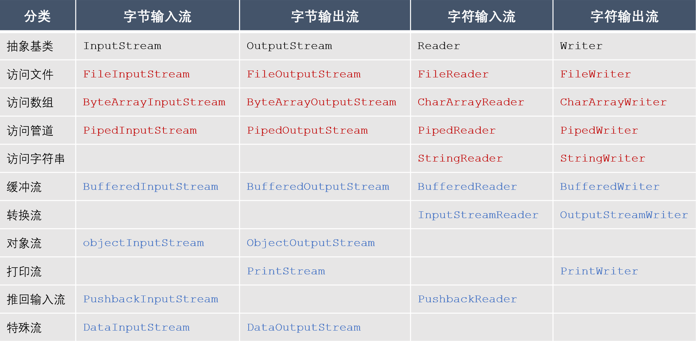
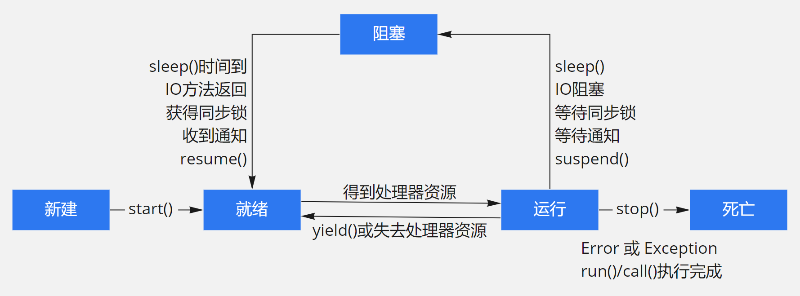

## Day3-Java基础

#### 3.1 介绍一下Java中的IO流

**参考答案**

IO（Input Output）用于实现对数据的输入与输出操作，Java把不同的输入/输出源（键盘、文件、网络等）抽象表述为流（Stream）。流是从起源到接收的有序数据，有了它程序就可以采用同一方式访问不同的输入/输出源。

- 按照数据流向，可以将流分为输入流和输出流，其中输入流只能读取数据、不能写入数据，而输出流只能写入数据、不能读取数据。
- 按照数据类型，可以将流分为字节流和字符流，其中字节流操作的数据单元是8位的字节，而字符流操作的数据单元是16位的字符。

- 按照处理功能，可以将流分为节点流和处理流，其中节点流可以直接从/向一个特定的IO设备（磁盘、网络等）读/写数据，也称为低级流，而处理流是对节点流的连接或封装，用于简化数据读/写功能或提高效率，也称为高级流。

Java提供了大量的类来支持IO操作，下表给大家整理了其中比较常用的一些类。其中，黑色字体的是抽象基类，其他所有的类都继承自它们。红色字体的是节点流，蓝色字体的是处理流。



#### 3.2 怎么用流打开一个大文件？

**参考答案**

打开大文件，应避免直接将文件中的数据全部读取到内存中，可以采用分次读取的方式。

1. 使用缓冲流。缓冲流内部维护了一个缓冲区，通过与缓冲区的交互，减少与设备的交互次数。使用缓冲输入流时，它每次会读取一批数据将缓冲区填满，每次调用读取方法并不是直接从设备取值，而是从缓冲区取值，当缓冲区为空时，它会再一次读取数据，将缓冲区填满。使用缓冲输出流时，每次调用写入方法并不是直接写入到设备，而是写入缓冲区，当缓冲区填满时它会自动刷入设备。
2. 使用NIO。NIO采用内存映射文件的方式来处理输入/输出，NIO将文件或文件的一段区域映射到内存中，这样就可以像访问内存一样来访问文件了（这种方式模拟了操作系统上的虚拟内存的概念），通过这种方式来进行输入/输出比传统的输入/输出要快得多。

#### 3.4 介绍一下Java的序列化与反序列化

**参考答案**

序列化机制可以将对象转换成字节序列，这些字节序列可以保存在磁盘上，也可以在网络中传输，并允许程序将这些字节序列再次恢复成原来的对象。其中，对象的序列化（Serialize），是指将一个Java对象写入IO流中，对象的反序列化（Deserialize），则是指从IO流中恢复该Java对象。

若对象要支持序列化机制，则它的类需要实现Serializable接口，该接口是一个标记接口，它没有提供任何方法，只是标明该类是可以序列化的，Java的很多类已经实现了Serializable接口，如包装类、String、Date等。

若要实现序列化，则需要使用对象流ObjectInputStream和ObjectOutputStream。其中，在序列化时需要调用ObjectOutputStream对象的writeObject()方法，以输出对象序列。在反序列化时需要调用ObjectInputStream对象的readObject()方法，将对象序列恢复为对象。

#### 3.5 Serializable接口为什么需要定义serialVersionUID变量？

**参考答案**

serialVersionUID代表序列化的版本，通过定义类的序列化版本，在反序列化时，只要对象中所存的版本和当前类的版本一致，就允许做恢复数据的操作，否则将会抛出序列化版本不一致的错误。

如果不定义序列化版本，在反序列化时可能出现冲突的情况，例如：

1. 创建该类的实例，并将这个实例序列化，保存在磁盘上；
2. 升级这个类，例如增加、删除、修改这个类的成员变量；
3. 反序列化该类的实例，即从磁盘上恢复修改之前保存的数据。

在第3步恢复数据的时候，当前的类已经和序列化的数据的格式产生了冲突，可能会发生各种意想不到的问题。增加了序列化版本之后，在这种情况下则可以抛出异常，以提示这种矛盾的存在，提高数据的安全性。

#### 3.7 如果不用JSON工具，该如何实现对实体类的序列化？

**参考答案**

可以使用Java原生的序列化机制，但是效率比较低一些，适合小项目；

可以使用其他的一些第三方类库，比如Protobuf、Thrift、Avro等。

**扩展阅读**

通过继承Thread类、实现Runnable接口、实现Callable接口都可以实现多线程，不过实现Runnable接口与实现Callable接口的方式基本相同，只是Callable接口里定义的方法有返回值，可以声明抛出异常而已。因此可以将实现Runnable接口和实现Callable接口归为一种方式。

采用实现Runnable、Callable接口的方式创建多线程的优缺点：

- 线程类只是实现了Runnable接口或Callable接口，还可以继承其他类。
- 在这种方式下，多个线程可以共享同一个target对象，所以非常适合多个相同线程来处理同一份资源的情况，从而可以将CPU、代码和数据分开，形成清晰的模型，较好地体现了面向对象的思想。
- 劣势是，编程稍稍复杂，如果需要访问当前线程，则必须使用Thread.currentThread()方法。

采用继承Thread类的方式创建多线程的优缺点：

- 劣势是，因为线程类已经继承了Thread类，所以不能再继承其他父类。
- 优势是，编写简单，如果需要访问当前线程，则无须使用Thread.currentThread()方法，直接使用this即可获得当前线程。

鉴于上面分析，因此一般推荐采用实现Runnable接口、Callable接口的方式来创建多线程。

#### 4.3 run()和start()有什么区别？

**参考答案**

run()方法被称为线程执行体，它的方法体代表了线程需要完成的任务，而start()方法用来启动线程。

调用start()方法启动线程时，系统会把该run()方法当成线程执行体来处理。但如果直接调用线程对象的run()方法，则run()方法立即就会被执行，而且在run()方法返回之前其他线程无法并发执行。也就是说，如果直接调用线程对象的run()方法，系统把线程对象当成一个普通对象，而run()方法也是一个普通方法，而不是线程执行体。

#### 4.4 线程是否可以重复启动，会有什么后果？

**参考答案**

只能对处于新建状态的线程调用start()方法，否则将引发IllegalThreadStateException异常。

**扩展阅读**

当程序使用new关键字创建了一个线程之后，该线程就处于新建状态，此时它和其他的Java对象一样，仅仅由Java虚拟机为其分配内存，并初始化其成员变量的值。此时的线程对象没有表现出任何线程的动态特征，程序也不会执行线程的线程执行体。

当线程对象调用了start()方法之后，该线程处于就绪状态，Java虚拟机会为其创建方法调用栈和程序计数器，处于这个状态中的线程并没有开始运行，只是表示该线程可以运行了。至于该线程何时开始运行，取决于JVM里线程调度器的调度。



#### 4.9 说一说sleep()和wait()的区别

**参考答案**

1. sleep()是Thread类中的静态方法，而wait()是Object类中的成员方法；
2. sleep()可以在任何地方使用，而wait()只能在同步方法或同步代码块中使用；
3. sleep()不会释放锁，而wait()会释放锁，并需要通过notify()/notifyAll()重新获取锁。

#### 4.11 如何实现子线程先执行，主线程再执行？

**参考答案**

启动子线程后，立即调用该线程的join()方法，则主线程必须等待子线程执行完成后再执行。

**扩展阅读**

Thread类提供了让一个线程等待另一个线程完成的方法——join()方法。当在某个程序执行流中调用其他线程的join()方法时，调用线程将被阻塞，直到被join()方法加入的join线程执行完为止。

join()方法通常由使用线程的程序调用，以将大问题划分成许多小问题，每个小问题分配一个线程。当所有的小问题都得到处理后，再调用主线程来进一步操作。

#### 4.12 阻塞线程的方式有哪些？

**参考答案**

当发生如下情况时，线程将会进入阻塞状态：

- 线程调用sleep()方法主动放弃所占用的处理器资源；
- 线程调用了一个阻塞式IO方法，在该方法返回之前，该线程被阻塞；
- 线程试图获得一个同步监视器，但该同步监视器正被其他线程所持有；
- 线程在等待某个通知（notify）；
- 程序调用了线程的suspend()方法将该线程挂起，但这个方法容易导致死锁，所以应该尽量避免使用该方法。


### SQL

MySQL的分页语法：

```mysql
-- 在所有的查询结果中，返回前5行记录。 
SELECT prod_name FROM products LIMIT 5; 
-- 在所有的查询结果中，从第5行开始，返回5行记录。
SELECT prod_name FROM products LIMIT 5,5;
```

优化LIMIT分页：

在偏移量非常大的时候，例如 LIMIT 10000,20 这样的查询，这时MySQL需要查询10020条记录然后只返回最后20条，前面的10000条记录都将被抛弃，这样的代价是非常高的。如果所有的页面被访问的频率都相同，那么这样的查询平均需要访问半个表的数据。要优化这种查询，要么是在页面中限制分页的数量，要么是优化大偏移量的性能。

优化此类分页查询的一个最简单的办法就是尽可能地使用索引覆盖扫描，而不是查询所有的列，然后根据需要做一次关联操作再返回所需的列。对于偏移量很大的时候，这样做的效率会提升非常大。考虑下面的查询：

```mysql
SELECT film_id,description FROM sakila.film ORDER BY title LIMIT 50,5;
```

如果这个表非常大，那么这个查询最好改写成下面的样子：

```mysql
SELECT film.film_id,film.description  FROM sakila.film INNER JOIN (  SELECT film_id FROM sakila.film ORDER BY title LIMIT 50,5 ) AS lim USING(film_id);

```

这里的“延迟关联”将大大提升查询效率，它让MySQL扫描尽可能少的页面，获取需要访问的记录后再根据关联列回原表查询需要的所有列。这个技术也可以用于优化关联查询中的LIMIT子句。

有时候也可以将LIMIT查询转换为已知位置的查询，让MySQL通过范围扫描获得对应的结果。例如，如果在一个位置列上有索引，并且预先计算出了边界值，上面的查询就可以改写为：

```mysql
SELECT film_id,description FROM skila.film WHERE position BETWEEN 50 AND 54 ORDER BY position;
```

LIMIT和OFFSET的问题，其实是OFFSET的问题，它会导致MySQL扫描大量不需要的行然后再抛弃掉。如果可以使用书签记录上次取数的位置，那么下次就可以直接从该书签记录的位置开始扫描，这样就可以避免使用OFFSET。例如，若需要按照租赁记录做翻页，那么可以根据最新一条租赁记录向后追溯，这种做法可行是因为租赁记录的主键是单调增长的。首先使用下面的查询获得第一组结果：

```mysql
SELECT * FROM sakila.rental ORDER BY rental_id DESC LIMIT 20;
```

假设上面的查询返回的是主键16049到16030的租赁记录，那么下一页查询就可以从16030这个点开始：

```mysql
SELECT * FROM sakila.rental  WHERE rental_id < 16030 ORDER BY rental_id DESC LIMIT 20;
```

该技术的好处是无论翻页到多么后面，其性能都会很好。