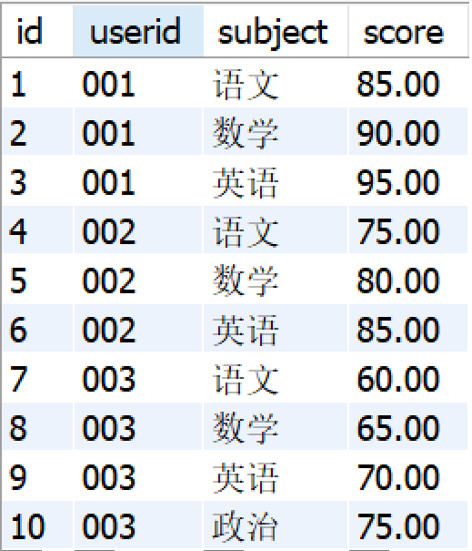
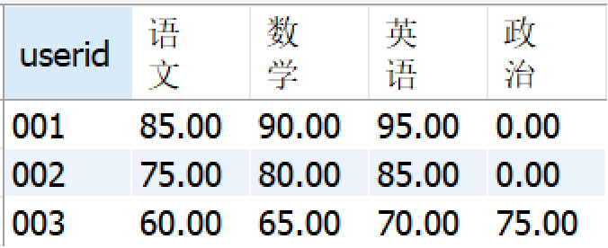

## Day4-数据库

#### 1.3 表跟表是怎么关联的？

**参考答案**

表与表之间常用的关联方式有两种：内连接、外连接，下面以MySQL为例来说明这两种连接方式。

内连接：

内连接通过**INNER JOIN**来实现，它将返回两张表中满足连接条件的数据，**不满足条件的数据不会查询出来**。

外连接：

外连接通过**OUTER JOIN**来实现，它会返回两张表中满足连接条件的数据，同时返回不满足连接条件的数据。外连接有两种形式：左外连接**（LEFT OUTER JOIN）**、右外连接**（RIGHT OUTER JOIN）**。

- 左外连接：可以简称为左连接（LEFT JOIN），它会返回**左表中的所有记录和右表中满足连接条件的记录**。
- 右外连接：可以简称为右连接（RIGHT JOIN），它会返回**右表中的所有记录和左表中满足连接条件的记录**。
- 实际上，外连接还有一种形式：完全外连接（FULL OUTER JOIN），但MySQL不支持这种形式。

除此之外，还有一种常见的连接方式：**等值连接。这种连接是通过WHERE子句中的条件，**将两张表连接在一起，它的实际效果等同于内连接。出于语义清晰的考虑，一般更建议使用内连接，而不是等值连接。

以上是从语法上来说明表与表之间关联的实现方式，而从表的关系上来说，比较常见的关联关系有：一对多关联、多对多关联、自关联。

- 一对多关联：这种关联形式最为常见，一般是两张表具有主从关系，并且以主表的主键关联从表的外键来实现这种关联关系。另外，以从表的角度来看，它们是具有多对一关系的，所以不再赘述多对一关联了。

- 以一个常见的例子来说明：一个作者可以写多本书，但每本书只能有一个作者。这里，作者和书之间就是一对多的关系。

- ```sql
  -- 创建作者表
  CREATE TABLE Authors (
      AuthorID int PRIMARY KEY,
      Name varchar(100) NOT NULL
  );
  -- 在这里，`Authors` 表是"一"的一端，其中 `AuthorID` 是主键。
  
  -- 创建书籍表
  CREATE TABLE Books (
      BookID int PRIMARY KEY,
      Title varchar(100) NOT NULL,
      AuthorID int,
      FOREIGN KEY (AuthorID) REFERENCES Authors(AuthorID)
  );
  -- 在这里，`Books` 表是"多"的一端，其中 `BookID` 是主键。
  -- `AuthorID` 是外键，用来引用 `Authors` 表的 `AuthorID`。
  
  ```

  

- 多对多关联：这种关联关系比较复杂，如果两张表具有多对多的关系，那么它们之间需要有一张中间表来作为衔接，以实现这种关联关系。这个中间表要设计两列，分别存储那两张表的主键。因此，这两张表中的任何一方，都与中间表形成了一对多关系，从而在这个中间表上建立起了多对多关系。

- 自关联：自关联就是一张表自己与自己相关联，为了避免表名的冲突，需要在关联时通过别名将它们当做两张表来看待。一般在表中数据具有层级（树状）时，可以采用自关联一次性查询出多层级的数据。

#### 1.6 SQL中怎么将行转成列？

<div style="text-align:center">
    
    
</div>

```sql
SELECT 
	userid, 
	SUM(CASE `subject` WHEN '语文' THEN score ELSE 0 END) as '语文', 
	SUM(CASE `subject` WHEN '数学' THEN score ELSE 0 END) as '数学', 
	SUM(CASE `subject` WHEN '英语' THEN score ELSE 0 END) as '英语', 
	SUM(CASE `subject` WHEN '政治' THEN score ELSE 0 END) as '政治'  
FROM tb_score  
GROUP BY userid

SELECT 
	userid, 
	SUM(IF(`subject`='语文',score,0)) as '语文', 
	SUM(IF(`subject`='数学',score,0)) as '数学', 
	SUM(IF(`subject`='英语',score,0)) as '英语', 
	SUM(IF(`subject`='政治',score,0)) as '政治'  
FROM tb_score  
GROUP BY userid
```

#### 1.7 谈谈你对SQL注入的理解

**参考答案**

SQL注入的原理是将SQL代码伪装到输入参数中，传递到服务器解析并执行的一种攻击手法。也就是说，在一些对SERVER端发起的请求参数中植入一些SQL代码，SERVER端在执行SQL操作时，会拼接对应参数，同时也将一些SQL注入攻击的“SQL”拼接起来，导致会执行一些预期之外的操作。

比如我们的登录功能，其登录界面包括用户名和密码输入框以及提交按钮，登录时需要输入用户名和密码，然后提交。此时调用接口/user/login/ 加上参数username、password，首先连接数据库，然后后台对请求参数中携带的用户名、密码进行参数校验，即SQL的查询过程。假设正确的用户名和密码为ls和123456，输入正确的用户名和密码、提交，相当于调用了以下的SQL语句。

```sql
SELECT * FROM user WHERE username = 'ls' AND password = '123456'
```

SQL中会将#及--以后的字符串当做注释处理，如果我们使用 ' or 1=1 # 作为用户名参数，那么服务端构建的SQL语句就如下：

```sql
select * from user where username='' or 1=1 #' and password='123456'
```

而#会忽略后面的语句，而1=1属于常等型条件，因此这个SQL将查询出所有的登录用户。其实上面的SQL注入只是在参数层面做了些手脚，如果是引入了一些功能性的SQL那就更危险了，比如上面的登录功能，如果用户名使用这个 ' or 1=1;delete * from users; #，那么在";"之后相当于是另外一条新的SQL，这个SQL是删除全表，是非常危险的操作，因此SQL注入这种还是需要特别注意的。

如何解决SQL注入

1. 严格的参数校验

   参数校验就没得说了，在一些不该有特殊字符的参数中提前进行特殊字符校验即可。

2. SQL预编译

   在知道了SQL注入的原理之后，我们同样也了解到MySQL有预编译的功能，指的是在服务器启动时，MySQL Client把SQL语句的模板（变量采用占位符进行占位）发送给MySQL服务器，MySQL服务器对SQL语句的模板进行编译，编译之后根据语句的优化分析对相应的索引进行优化，在最终绑定参数时把相应的参数传送给MySQL服务器，直接进行执行，节省了SQL查询时间，以及MySQL服务器的资源，达到一次编译、多次执行的目的，除此之外，还可以防止SQL注入。

   具体是怎样防止SQL注入的呢？实际上当将绑定的参数传到MySQL服务器，MySQL服务器对参数进行编译，即填充到相应的占位符的过程中，做了转义操作。我们常用的JDBC就有预编译功能，不仅提升性能，而且防止SQL注入。

3. mybatis如何防止sql注入

   1. MyBatis 默认使用预处理语句（`PreparedStatement`），这是一种预编译的SQL语句，可以带有一个或多个占位符（`?`），然后由应用程序提供具体的参数值。

      **性能提升**：因为SQL语句在数据库级别预编译，所以执行起来比普通的语句更快。

      **防止SQL注入**：通过将用户输入作为参数传递给预处理语句，而不是直接拼接到SQL语句中，可以防止恶意的SQL代码注入，因为用户输入会被数据库处理为字符串，而不是执行的SQL代码。

   2. ### 使用MyBatis的参数替换

      在MyBatis的XML映射文件或使用注解方式的SQL语句中，你可以使用`#{}`来标识一个参数占位符，例如：

      ```xml
      <select id="selectUser" parameterType="int" resultType="User">
        SELECT * FROM user WHERE id = #{id}
      </select>
      ```

      在这个例子中，`#{id}`是一个参数占位符，MyBatis 会在执行时自动替换为实际的参数值，并且以安全的方式处理，从而避免SQL注入。

      ### 避免使用字符串拼接构造SQL语句

      在编写SQL语句时，应避免直接使用字符串拼接的方式来插入变量，尤其是用户输入的数据。这是因为直接拼接容易造成SQL注入。相反，应该使用MyBatis提供的参数替换功能，不要用美元符号$。

#### 1.8 将一张表的部分数据更新到另一张表，该如何操作呢？

**参考答案**

可以采用关联更新的方式，将一张表的部分数据，更新到另一张表内。参考如下代码：

```sql
update b set b.col=a.col from a,b where a.id=b.id;
update b set col=a.col from b inner join a on a.id=b.id;
update b set b.col=a.col from b left Join a on b.id = a.id;
```

#### 1.9 WHERE和HAVING有什么区别？

**参考答案**

WHERE是一个约束声明，使用WHERE约束来自数据库的数据，WHERE是在结果返回之前起作用的，WHERE中不能使用聚合函数。

HAVING是一个过滤声明，是在查询返回结果集以后对查询结果进行的过滤操作，在HAVING中可以使用聚合函数。另一方面，HAVING子句中不能使用除了分组字段和聚合函数之外的其他字段。

从性能的角度来说，HAVING子句中如果使用了分组字段作为过滤条件，应该替换成WHERE子句。因为WHERE可以在执行分组操作和计算聚合函数之前过滤掉不需要的数据，性能会更好。