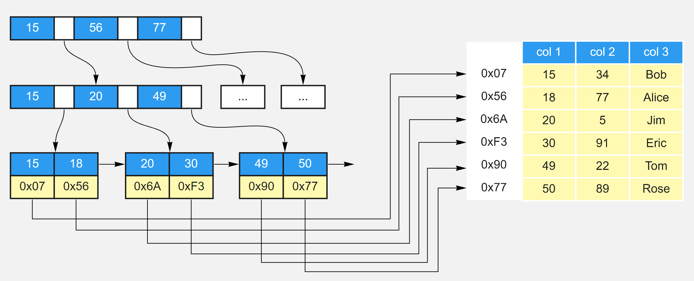
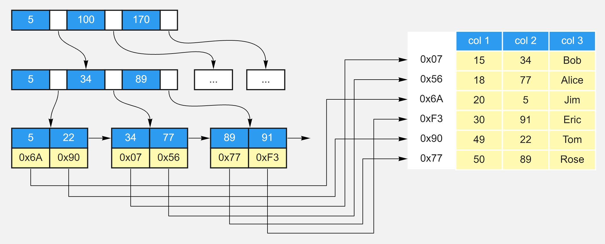

## Day5-数据库

### 2. 索引

#### 2.1 说一说你对MySQL索引的理解

**参考答案**

索引是一个单独的、存储在磁盘上的数据库结构，包含着对数据表里所有记录的引用指针。使用索引可以快速找出在某个或多个列中有一特定值的行，所有MySQL列类型都可以被索引，对相关列使用索引是提高查询操作速度的最佳途径。

索引是在存储引擎中实现的，因此，每种存储引擎的索引都不一定完全相同，并且每种存储引擎也不一定支持所有索引类型。MySQL中索引的存储类型有两种，即BTREE和HASH，具体和表的存储引擎相关。MyISAM和InnoDB存储引擎只支持BTREE索引；MEMORY/HEAP存储引擎可以支持HASH和BTREE索引。

索引的优点主要有以下几条：

1. 通过创建唯一索引，可以保证数据库表中每一行数据的唯一性。
2. 可以大大加快数据的查询速度，这也是创建索引的主要原因。
3. 在实现数据的参考完整性方面，可以加速表和表之间的连接。
4. 在使用分组和排序子句进行数据查询时，也可以显著减少查询中分组和排序的时间。

增加索引也有许多不利的方面，主要表现在如下几个方面：

1. 创建索引和维护索引要耗费时间，并且随着数据量的增加所耗费的时间也会增加。
2. 索引需要占磁盘空间，除了数据表占数据空间之外，每一个索引还要占一定的物理空间，如果有大量的索引，索引文件可能比数据文件更快达到最大文件尺寸。
3. 当对表中的数据进行增加、删除和修改的时候，索引也要动态地维护，这样就降低了数据的维护速度。

#### 2.2 索引有哪几种？

**参考答案**

MySQL的索引可以分为以下几类：

1. 普通索引和唯一索引

   普通索引是MySQL中的基本索引类型，允许在定义索引的列中插入重复值和空值。

   唯一索引要求索引列的值必须唯一，但允许有空值。如果是组合索引，则列值的组合必须唯一，**可以有多个空值**。

   主键索引是一种特殊的唯一索引，不允许有空值。

2. 单列索引和组合索引

   单列索引即一个索引只包含单个列，一个表可以有多个单列索引。

   组合索引是指在表的多个字段组合上创建的索引，只有在查询条件中使用了这些字段的左边字段时，索引才会被使用。使用组合索引时遵循最左前缀集合。

3. 全文索引

   全文索引类型为FULLTEXT，在定义索引的列上支持值的全文查找，允许在这些索引列中插入重复值和空值。全文索引可以在CHAR、VARCHAR或者TEXT类型的列上创建。

4. 空间索引

   空间索引是对空间数据类型的字段建立的索引，MySQL中的空间数据类型有4种，分别是GEOMETRY、POINT、LINESTRING和POLYGON。MySQL使用SPATIAL关键字进行扩展，使得能够用创建正规索引类似的语法创建空间索引。创建空间索引的列，必须将其声明为NOT NULL，空间索引只能在存储引擎为MyISAM的表中创建。

#### 2.3 如何创建及保存MySQL的索引？

**参考答案**

MySQL支持多种方法在单个或多个列上创建索引：

在创建表的时候创建索引：

使用CREATE TABLE创建表时，除了可以定义列的数据类型，还可以定义主键约束、外键约束或者唯一性约束，而不论创建哪种约束，在定义约束的同时相当于在指定列上创建了一个索引。创建表时创建索引的基本语法如下：

```mysql
CREATE TABLE table_name [col_name data_type] [UNIQUE|FULLTEXT|SPATIAL] [INDEX|KEY] [index_name] (col_name [length]) [ASC|DESC]
```

其中，UNIQUE、FULLTEXT和SPATIAL为可选参数，分别表示唯一索引、全文索引和空间索引；INDEX与KEY为同义词，两者作用相同，用来指定创建索引。

例如，可以按照如下方式，在id字段上使用UNIQUE关键字创建唯一索引：

```mysql
CREATE TABLE t1 (  id INT NOT NULL,     name CHAR(30) NOT NULL,     UNIQUE INDEX UniqIdx(id) );
```

在已存在的表上创建索引

在已经存在的表中创建索引，可以使用ALTER TABLE语句或者CREATEINDEX语句。

ALTER TABLE创建索引的基本语法如下：

```mysql
ALTER TABLE table_name ADD  [UNIQUE|FULLTEXT|SPATIAL] [INDEX|KEY] [index_name] (col_name[length],...) [ASC|DESC]
```

例如，可以按照如下方式，在bookId字段上建立名称为UniqidIdx的唯一索引：

```mysql
ALTER TABLE book ADD UNIQUE INDEX UniqidIdx (bookId);
```

CREATE INDEX创建索引的基本语法如下：

```mysql
CREATE [UNIQUE|FULLTEXT|SPATIAL] INDEX index_name  ON table_name (col_name [length],...) [ASC|DESC]
```

例如，可以按照如下方式，在bookId字段上建立名称为UniqidIdx的唯一索引：

```mysql
CREATE UNIQUE INDEX UniqidIdx ON book (bookId);
```

#### 2.5 只要创建了索引，就一定会走索引吗？

**参考答案**

不一定。

比如，在使用组合索引的时候，如果没有遵从“最左前缀”的原则进行搜索，则索引是不起作用的。

举例，假设在id、name、age字段上已经成功建立了一个名为MultiIdx的组合索引。索引行中按id、name、age的顺序存放，索引可以搜索id、（id,name）、（id, name, age）字段组合。如果列不构成索引最左面的前缀，那么MySQL不能使用局部索引，如（age）或者（name,age）组合则不能使用该索引查询。

#### 2.6 如何判断数据库的索引有没有生效？

**参考答案**

可以使用EXPLAIN语句查看索引是否正在使用。

举例，假设已经创建了book表，并已经在其year_publication字段上建立了普通索引。执行如下语句：

```mysql
EXPLAIN SELECT * FROM book WHERE year_publication=1990;
```

EXPLAIN语句将为我们输出详细的SQL执行信息，其中：

- possible_keys行给出了MySQL在搜索数据记录时可选用的各个索引。
- key行是MySQL实际选用的索引。

如果possible_keys行和key行都包含year_publication字段，则说明在查询时使用了该索引。

#### 2.7 如何评估一个索引创建的是否合理？

**建议按照如下的原则来设计索引：**

1. 避免对经常更新的表进行过多的索引，并且索引中的列要尽可能少。应该经常用于查询的字段创建索引，但要避免添加不必要的字段。
2. 数据量小的表最好不要使用索引，由于数据较少，查询花费的时间可能比遍历索引的时间还要短，索引可能不会产生优化效果。
3. 在条件表达式中经常用到的不同值较多的列上建立索引，在不同值很少的列上不要建立索引。比如在学生表的“性别”字段上只有“男”与“女”两个不同值，因此就无须建立索引，如果建立索引不但不会提高查询效率，反而会严重降低数据更新速度。
4. 当唯一性是某种数据本身的特征时，指定唯一索引。使用唯一索引需能确保定义的列的数据完整性，以提高查询速度。
5. 在频繁进行排序或分组（即进行group by或order by操作）的列上建立索引，如果待排序的列有多个，可以在这些列上建立组合索引。

#### 2.8 索引是越多越好吗？

**参考答案**

索引并非越多越好，一个表中如有大量的索引，不仅占用磁盘空间，还会影响INSERT、DELETE、UPDATE等语句的性能，因为在表中的数据更改时，索引也会进行调整和更新。

#### 2.9 数据库索引失效了怎么办？

**参考答案**

可以采用以下几种方式，来避免索引失效：

1. 使用组合索引时，需要遵循“最左前缀”原则；
2. 不在索引列上做任何操作，例如计算、函数、类型转换，会导致索引失效而转向全表扫描；
3. 尽量使用覆盖索引（之访问索引列的查询），减少 select * 覆盖索引能减少回表次数；
4. MySQL在使用不等于（!=或者<>）的时候无法使用索引会导致全表扫描；
5. LIKE以通配符开头（%abc）MySQL索引会失效变成全表扫描的操作；
6. 字符串不加单引号会导致索引失效（可能发生了索引列的隐式转换）；
7. 少用or，用它来连接时会索引失效。

#### 2.10 所有的字段都适合创建索引吗？

**参考答案**

不是。

下列几种情况，是不适合创建索引的：

1. 频繁更新的字段不适合建立索引；
2. where条件中用不到的字段不适合建立索引；
3. 数据比较少的表不需要建索引；
4. 数据重复且分布比较均匀的的字段不适合建索引，例如性别、真假值；
5. 参与列计算的列不适合建索引。

#### 2.11 说一说索引的实现原理

**参考答案**

在MySQL中，索引是在存储引擎层实现的，不同存储引擎对索引的实现方式是不同的，下面我们探讨一下MyISAM和InnoDB两个存储引擎的索引实现方式。

MyISAM索引实现：

MyISAM引擎使用B+Tree作为索引结构，叶节点的data域存放的是数据记录的地址，MyISAM索引的原理图如下。这里假设表一共有三列，假设我们以Col1为主键，则上图是一个MyISAM表的主索引（Primary key）示意。可以看出MyISAM的索引文件仅仅保存数据记录的地址。在MyISAM中，主索引和辅助索引（Secondary key）在结构上没有任何区别，只是主索引要求key是唯一的，而辅助索引的key可以重复。



如果我们在Col2上建立一个辅助索引，则此索引的结构如下图所示。同样也是一颗B+Tree，data域保存数据记录的地址。因此，MyISAM中索引检索的算法为首先按照B+Tree搜索算法搜索索引，如果指定的Key存在，则取出其data域的值，然后以data域的值为地址，读取相应数据记录。



InnoDB索引实现：

虽然InnoDB也使用B+Tree作为索引结构，但具体实现方式却与MyISAM截然不同。

第一个重大区别是InnoDB的数据文件本身就是索引文件。从上文知道，MyISAM索引文件和数据文件是分离的，索引文件仅保存数据记录的地址。而在InnoDB中，表数据文件本身就是按B+Tree组织的一个索引结构，这棵树的叶节点data域保存了完整的数据记录。这个索引的key是数据表的主键，因此InnoDB表数据文件本身就是主索引。

下图是InnoDB主索引（同时也是数据文件）的示意图，可以看到叶节点包含了完整的数据记录。这种索引叫做聚集索引。因为InnoDB的数据文件本身要按主键聚集，所以InnoDB要求表必须有主键（MyISAM可以没有），如果没有显式指定，则MySQL系统会自动选择一个可以唯一标识数据记录的列作为主键，如果不存在这种列，则MySQL自动为InnoDB表生成一个隐含字段作为主键，这个字段长度为6个字节，类型为长整形。


第二个与MyISAM索引的不同是InnoDB的辅助索引data域存储相应记录主键的值而不是地址。换句话说，InnoDB的所有辅助索引都引用主键作为data域。下图为定义在Col3上的一个辅助索引。这里以英文字符的ASCII码作为比较准则。聚集索引这种实现方式使得按主键的搜索十分高效，但是辅助索引搜索需要检索两遍索引：首先检索辅助索引获得主键，然后用主键到主索引中检索获得记录。


了解不同存储引擎的索引实现方式对于正确使用和优化索引都非常有帮助，例如知道了InnoDB的索引实现后，就很容易明白为什么不建议使用过长的字段作为主键，因为所有辅助索引都引用主索引，过长的主索引会令辅助索引变得过大。再例如，用非单调的字段作为主键在InnoDB中不是个好主意，因为InnoDB数据文件本身是一颗B+Tree，非单调的主键会造成在插入新记录时数据文件为了维持B+Tree的特性而频繁的分裂调整，十分低效，而使用自增字段作为主键则是一个很好的选择。

#### 2.12 介绍一下数据库索引的重构过程

**参考答案**

什么时候需要重建索引呢？

1. 表上频繁发生update,delete操作；
2. 表上发生了alter table ..move操作（move操作导致了rowid变化）。

怎么判断索引是否应该重建？

1. 一般看索引是否倾斜的严重，是否浪费了空间，对索引进行结构分析：

   ```mysql
   analyze index index_name validate structure;
   ```

2. 在相同的session中查询index_stats表：

   ```mysql
   select height,DEL_LF_ROWS/LF_ROWS from index_stats;
   ```

   当查询的height>=4（索引的深度，即从根到叶节点的高度）或DEL_LF_ROWS/LF_ROWS>0.2的情况下，就应该考虑重建该索引。

如何重建索引？

- drop原索引，然后再创建索引：

  ```mysql
  drop index index_name;
  create index index_name on table_name (index_column);
  ```

  这种方式相当耗时，一般不建议使用。

- 直接重建索引：

  ```mysql
  alter index indexname rebuild;
  alter index indexname rebuild online;
  ```

  此方法较快，建议使用。

rebuild是快速重建索引的一种有效的办法，因为它是一种使用现有索引项来重建新索引的方法。如果重建索引时有其他用户在对这个表操作，尽量使用带online参数来最大限度的减少索引重建时将会出现的任何加锁问题。由于新旧索引在建立时同时存在，因此，使用这种重建方法需要有额外的磁盘空间可供临时使用，当索引建完后把老索引删除，如果没有成功，也不会影响原来的索引。利用这种办法可以用来将一个索引移到新的表空间。

rebuild重建索引的过程：

1. Rebuild以index fast full scan或table full scan方式（采用那种方式取决于cost）读取原索引中的数据来构建一个新的索引，重建过程中有排序操作，rebuild online执行表扫描获取数据，重建过程中有排序的操作；
2. Rebuild会阻塞DML操作，rebuild online不会阻塞DML操作；
3. rebuild online时系统会产生一个SYS_JOURNAL_xxx的IOT类型的系统临时日志表，所有rebuild online时索引的变化都记录在这个表中，当新的索引创建完成后，把这个表的记录维护到新的索引中去，然后drop掉旧的索引，rebuild online就完成了。

重建索引过程中的注意事项：

1. 执行rebuild操作时，需要检查表空间是否足够；
2. 虽然说rebuild online操作允许DML操作，但还是建议在业务不繁忙时间段进行；
3. Rebuild操作会产生大量Redo Log；

#### 2.13 MySQL的索引为什么用B+树？

**参考答案**

B+树由B树和索引顺序访问方法演化而来，它是为磁盘或其他直接存取辅助设备设计的一种平衡查找树，在B+树中，所有记录节点都是按键值的大小顺序存放在同一层的叶子节点，各叶子节点通过指针进行链接。如下图：


B+树索引在数据库中的一个特点就是高扇出性，例如在InnoDB存储引擎中，每个页的大小为16KB。在数据库中，B+树的高度一般都在2～4层，这意味着查找某一键值最多只需要2到4次IO操作，这还不错。因为现在一般的磁盘每秒至少可以做100次IO操作，2～4次的IO操作意味着查询时间只需0.02～0.04秒。

#### 2.14 联合索引的存储结构是什么，它的有效方式是什么？

**参考答案**

从本质上来说，联合索引还是一棵B+树，不同的是联合索引的键值数量不是1，而是大于等于2，参考下图。另外，只有在查询条件中使用了这些字段的左边字段时，索引才会被使用，所以使用联合索引时遵循最左前缀集合。


#### 2.15 MySQL的Hash索引和B树索引有什么区别？

**参考答案**

hash索引底层就是hash表，进行查找时，调用一次hash函数就可以获取到相应的键值，之后进行回表查询获得实际数据。B+树底层实现是多路平衡查找树，对于每一次的查询都是从根节点出发，查找到叶子节点方可以获得所查键值，然后根据查询判断是否需要回表查询数据。它们有以下的不同：

- hash索引进行等值查询更快(一般情况下)，但是却无法进行范围查询。因为在hash索引中经过hash函数建立索引之后，索引的顺序与原顺序无法保持一致，不能支持范围查询。而B+树的的所有节点皆遵循(左节点小于父节点，右节点大于父节点，多叉树也类似)，天然支持范围。
- hash索引不支持使用索引进行排序，原理同上。
- hash索引不支持模糊查询以及多列索引的最左前缀匹配，原理也是因为hash函数的不可预测。
- hash索引任何时候都避免不了回表查询数据，而B+树在符合某些条件(聚簇索引，覆盖索引等)的时候可以只通过索引完成查询。
- hash索引虽然在等值查询上较快，但是不稳定，性能不可预测，当某个键值存在大量重复的时候，发生hash碰撞，此时效率可能极差。而B+树的查询效率比较稳定，对于所有的查询都是从根节点到叶子节点，且树的高度较低。

因此，在大多数情况下，直接选择B+树索引可以获得稳定且较好的查询速度。而不需要使用hash索引。

#### 2.16 聚簇索引和非聚簇索引有什么区别？

**参考答案**

在InnoDB存储引擎中，可以将B+树索引分为聚簇索引和辅助索引（非聚簇索引）。无论是何种索引，每个页的大小都为16KB，且不能更改。

聚簇索引是根据主键创建的一棵B+树，聚簇索引的叶子节点存放了表中的所有记录。辅助索引是根据索引键创建的一棵B+树，与聚簇索引不同的是，其叶子节点仅存放索引键值，以及该索引键值指向的主键。也就是说，如果通过辅助索引来查找数据，那么当找到辅助索引的叶子节点后，很有可能还需要根据主键值查找聚簇索引来得到数据，这种查找方式又被称为书签查找。因为辅助索引不包含行记录的所有数据，这就意味着每页可以存放更多的键值，因此其高度一般都要小于聚簇索引。

#### 2.18 select in语句中如何使用索引？

**参考答案**

索引是否起作用，主要取决于字段类型：

- 如果字段类型为字符串，需要给in查询中的数值与字符串值都需要添加引号，索引才能起作用。
- 如果字段类型为int，则in查询中的值不需要添加引号，索引也会起作用。

IN的字段，在联合索引中，按以上方法，也会起作用。

#### 2.19 模糊查询语句中如何使用索引？

**参考答案**

在MySQL中模糊查询 mobile like ‘%8765’，这种情况是不能使用 mobile 上的索引的，那么如果需要根据手机号码后四位进行模糊查询，可以用一下方法进行改造。

我们可以加入冗余列（MySQL5.7之后加入了虚拟列，使用虚拟列更合适，思路相同），比如 mobile_reverse，内部存储为 mobile 的倒叙文本，如 mobile为17312345678，那么 mobile_reverse 存储 87654321371，为 mobile_reverse 列建立索引，查询中使用语句 mobile_reverse like reverse(’%5678’) 即可。

reverse 是 MySQL 中的反转函数，这条语句相当于 mobile_reverse like ‘8765%’ ，这种语句是可以使用索引的。